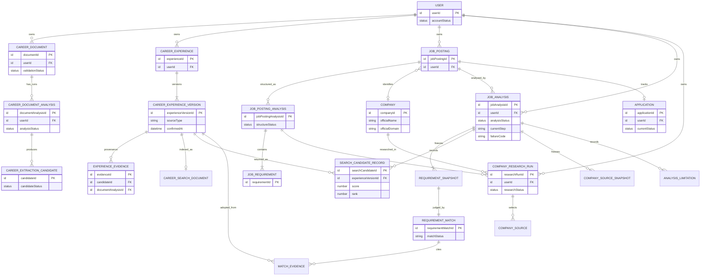

# AI 취업 지원 실행 플랫폼 MVP 도메인·데이터 설계 초안

- 문서 버전: v0.2
- 작성일: 2026-07-22
- 단계: 4/6 - 도메인·데이터 설계
- 기준 문서: 프로젝트 기획서 v0.2, 핵심 사용자 여정 및 유스케이스 v0.2, MVP 기능·비기능 요구사항 명세서 v0.2, 도메인·데이터 설계 초안 v0.1
- 구현 기준: Java 21·Spring Boot 기반 모듈형 모놀리스 MVP

## 0. v0.2 변경 요약

| 영역 | v0.2 결정 |
|---|---|
| 문서 분석 상태 | `QUEUED / PROCESSING / SUCCEEDED / FAILED`로 단순화했다. `SUCCEEDED`는 후보 생성·저장 성공이며 후보 확정 완료가 아니다. |
| 후보 검토 | 검토 필요 여부를 `CareerExtractionCandidate` 상태로만 판단한다. 문서 분석의 `REVIEW_REQUIRED / COMPLETED`를 제거했다. |
| 후보–확정 경력 | 병합·분리를 허용하므로 단순 FK 관계로 표현하지 않는다. `ExperienceEvidence`가 candidateId·documentAnalysisId·페이지·발췌를 provenance로 보존한다. |
| 분석 Snapshot | 사용자의 전체 확정 경력 복사를 제거했다. 검색 후보 ID·점수·순위와 실제 채택 경력의 표시용 Snapshot만 보존한다. |
| 실행 단계 | 별도 `AnalysisStep` 엔티티를 MVP에서 제외하고 `JobAnalysis`의 status·currentStep·failureCode·시각으로 관리한다. |
| 회사 데이터 격리 | `Company`만 전역 공유 기준정보로 두고 `CompanyResearchRun`에 userId를 둔다. 조사 문맥·채택 출처·Snapshot은 사용자·공고에 종속한다. |
| 직접 입력 | `CareerExperienceVersion.sourceType=USER_DIRECT`와 confirmedAt으로 표시하며 Evidence를 강제하지 않는다. |
| Application | 사용자가 처음 지원 상태를 설정할 때 생성하고 현재 상태만 저장한다. |
| 삭제 | 일반 삭제는 논리 삭제, 탈퇴·완전 삭제는 사용자 원본·파생·Snapshot·Vector까지 물리 삭제한다. |
| 개발 전 정책 | PDF 10MB·50페이지, 암호화·손상 거절, 붙여넣기 대체, 공고 원문 변경 시 새 공고, 부분 완료 최소 경계 등을 확정했다. |

## 1. 설계 목적과 범위

### 1.1 목적

다음 핵심 폐쇄 루프를 개인 개발자가 구현할 수 있는 최소 논리 모델로 정의한다.

> 경력 문서 등록 → 경력 후보 추출 → 사용자 수정·확정 → 공고 등록·구조화 → 확정 경력 검색 → 요구사항별 매칭·판정 → 회사 공식 정보 결합 → 결과 자동 저장 → 지원 상태 관리

본 설계는 사용자 데이터 격리, AI 후보와 확정 경력 분리, 근거 기반 판정, 회사 조사 실패 격리, 완료·부분 완료 결과 보존을 보장한다.

### 1.2 포함 범위

- Identity, Career, Job, Company Research, Analysis, Application 도메인
- 핵심 엔티티·값 객체·상태·관계·불변 조건
- 최소 Snapshot과 경력 버전 정책
- PostgreSQL·pgvector 적용을 고려한 RAG 논리 구조
- 삭제·보존 정책과 논리 ERD

### 1.3 제외 범위

- SQL DDL, 물리 컬럼 타입·인덱스
- API URI·DTO, 클래스·패키지
- 구체 LLM·임베딩·검색 제품과 프롬프트
- 메시지 브로커, 자유형 Multi-Agent, 내부 MCP
- 이벤트 소싱·CQRS·범용 Workflow 엔진

### 1.4 재현성의 의미

결과 재현성은 동일 모델 출력을 다시 생성하는 것을 뜻하지 않는다. 과거 분석에서 사용한 다음 정보를 확인할 수 있음을 뜻한다.

- 공고 요구사항과 그 구조화 버전
- 검색 후보로 반환된 경력 버전 ID, 검색 점수와 순위
- 최종 판정 근거로 채택된 경력과 당시 표시 내용
- 사용한 회사 공식 출처와 확인 시점
- Workflow 버전과 실행 시각

모델·프롬프트 식별정보는 운영 추적에 보존할 수 있지만 동일 출력을 보장하는 계약은 아니다.

## 2. 도메인 경계

| 도메인 | 책임 | 주요 데이터 | 주요 행위 | 다른 도메인과의 관계 | 포함하지 않는 책임 |
|---|---|---|---|---|---|
| Identity | 사용자 식별·인증·소유권 기준 | User | 가입, 인증, 로그아웃, 소유권 확인 | 모든 사용자 소유 Aggregate의 userId 기준 | 경력·공고 내용, 복잡한 계정 복구 |
| Career | 경력 원본, 분석 실행, 후보 검토, 확정 경력 버전·근거·검색 표현 | CareerDocument, CareerDocumentAnalysis, CareerExtractionCandidate, CareerExperience, CareerExperienceVersion, ExperienceEvidence, CareerSearchDocument | PDF 검증·추출, 붙여넣기 대체, 후보 생성·검토, 직접 입력·확정, 버전 생성, 재임베딩 | Analysis에 확정 경력 검색 결과 제공 | 공고 판정, 회사 조사, 후보 자동 확정 |
| Job | 공고 원문과 구조화 결과·요구사항 관리 | JobPosting, JobPostingAnalysis, JobRequirement | 본문 등록, 구조화, 이상 징후 확인, 수정 | Company 식별 단서와 Analysis 입력 제공 | 회사 웹 검색, 경력 검색, 판정 |
| Company Research | 전역 회사 기준정보와 사용자·공고별 공식 정보 조사 | Company, CompanyResearchRun, CompanySource | 공식 도메인 확인, 공식 자료 최대 5건 채택, 실패 기록 | Job 문맥을 입력받고 Analysis에 출처 제공 | 사용자 간 조사 문맥 공유, 경력 판정 |
| Analysis | 통제된 Workflow와 요구사항별 판정·결과 저장 | JobAnalysis, SearchCandidateRecord, RequirementSnapshot, CompanySourceSnapshot, RequirementMatch, MatchEvidence, AnalysisLimitation | 입력 검증, 검색, 판정, 전략 생성, 전체 재실행 | 다른 도메인은 읽기만 하고 원본을 수정하지 않음 | 범용 단계 엔티티, 판정 수동 덮어쓰기 |
| Application | 공고별 현재 지원 상태 | Application | 첫 상태 설정, 상태 변경, 목록 표시 | 사용자 소유 JobPosting과 연결 | 외부 지원 제출, 상세 이력·사유·전형 단계 |

## 3. 핵심 도메인 모델

### 3.1 분류

| 개념 | 분류 | 이유 |
|---|---|---|
| User | Aggregate Root | 사용자 데이터 소유권 기준 |
| CareerDocument | Aggregate Root | 원본과 문서 분석 실행의 생명주기 기준 |
| CareerDocumentAnalysis | 하위 엔티티 | 문서 분석 재실행·상태 추적 필요 |
| CareerExtractionCandidate | 하위 엔티티 | 후보별 검토 상태와 수정값 필요 |
| CareerExperience | Aggregate Root | 논리 경험의 정체성과 버전 생명주기 관리 |
| CareerExperienceVersion | 하위 불변 엔티티 | 확정 후 직접 수정하지 않고 새 버전 생성 |
| ExperienceEvidence | 하위 엔티티/값 객체 | 문서 기반 경력의 provenance이며 버전에 종속 |
| CareerSearchDocument | 파생 데이터 | 검색 인덱스이며 진실 원본이 아님 |
| JobPosting | Aggregate Root | 공고 원문과 구조화 실행의 기준 |
| JobPostingAnalysis | 하위 엔티티 | 구조화 결과의 재실행·수정 버전 |
| JobRequirement | 하위 엔티티 | 개별 판정 대상 |
| Company | Aggregate Root | 사용자 정보가 없는 전역 공유 기준정보 |
| CompanyResearchRun | 사용자 소유 실행 엔티티 | 사용자·공고 문맥별 조사 격리 |
| CompanySource | 조사 실행 하위 엔티티 | 해당 문맥에서 채택한 공식 자료 |
| JobAnalysis | Aggregate Root | 1회의 분석 실행과 불변 결과 기준 |
| SearchCandidateRecord | JobAnalysis 하위 엔티티 | 검색 후보 ID·점수·순위 보존 |
| RequirementSnapshot·CompanySourceSnapshot | JobAnalysis 하위 값 객체/엔티티 | 당시 입력·출처 확인용 |
| RequirementMatch | JobAnalysis 하위 엔티티 | 요구사항별 판정과 근거 연결 |
| AnalysisLimitation | 값 객체 컬렉션 | 실행에 종속된 제한사항 |
| Application | Aggregate Root | 공고별 현재 상태 독립 변경 |

`AnalysisStep`은 MVP 모델에서 제외한다. 단계별 상세 AI 호출 이력은 운영 로그 또는 후속 AI 실행 이력 설계에서 다룬다.

### 3.2 모델 상세

#### User

- **역할/소유:** 사용자 식별과 소유권 기준 / Identity
- **주요 속성·식별자:** userId, 인증 식별정보, accountStatus, 동의 정보, createdAt / UserId
- **생성 조건:** 가입·필수 동의·중복 검증 성공
- **수정 가능 범위:** 인증 정보와 계정 상태; userId 불변
- **삭제 정책:** 일반 비활성화 후 완전 삭제 요청 시 모든 사용자 소유 데이터 물리 삭제
- **주요 불변 조건:** 모든 사용자 업무 데이터는 정확히 한 User에 속함
- **관련 요구사항:** FR-AUTH-001~004, NFR-SEC-001~003, NFR-DATA-001

#### CareerDocument

- **역할/소유:** PDF 원본과 분석 실행 기준 / Career
- **주요 속성·식별자:** documentId, userId, originalName, storageReference, validationStatus, uploadedAt, deletedAt / CareerDocumentId
- **생성 조건:** PDF 최대 10MB·50페이지, 비암호화·정상 파일 검증과 저장 성공
- **수정 가능 범위:** 표시명만; 원본 바이트 교체 금지
- **삭제 정책:** 일반 삭제는 논리 삭제, 완전 삭제는 원본과 모든 종속 데이터 물리 삭제
- **불변 조건:** 소유자와 원본 불변, 저장 실패 시 분석 생성 금지
- **관련 요구사항:** FR-CAREER-001~005,012, NFR-SEC-001, NFR-DATA-004

#### CareerDocumentAnalysis

- **역할/소유:** 텍스트 추출과 후보 생성 1회 실행 / CareerDocument 하위
- **주요 속성·식별자:** documentAnalysisId, documentId, userId, inputKind(PDF_TEXT/PASTED_TEXT), status, extractedTextReference, failureCode, workflowVersion, startedAt, completedAt / CareerDocumentAnalysisId
- **생성 조건:** 유효 문서의 최초 분석 또는 전체 재실행, PDF 추출 실패 뒤 붙여넣기 입력
- **수정 가능 범위:** 실행 중 상태와 산출물; 종료 후 불변
- **삭제 정책:** 문서 일반 삭제 시 검색·목록 제외, 완전 삭제 시 텍스트·후보와 함께 물리 삭제
- **불변 조건:** `SUCCEEDED`는 후보 생성·저장 성공만 뜻함; 후보 확정 완료를 뜻하지 않음. 재실행은 새 실행 생성
- **관련 요구사항:** FR-CAREER-003~006,012, NFR-AVAIL-001,003~004, NFR-OBS-001

#### CareerExtractionCandidate

- **역할/소유:** AI가 제시하고 사용자가 검토하는 미확정 후보 / CareerDocumentAnalysis 하위
- **주요 속성·식별자:** candidateId, documentAnalysisId, userId, candidateType, 경험 내용, status, revisionNo / CareerExtractionCandidateId
- **생성 조건:** 구조 검증을 통과한 후보와 원문 provenance 확보
- **수정 가능 범위:** 사용자 수정·확정·거절; AI 원안과 사용자 수정값 구분 권장
- **삭제 정책:** 일반적으로 REJECTED 또는 논리 삭제, 완전 삭제 시 물리 삭제
- **불변 조건:** 후보 상태가 검토 필요 여부의 유일한 기준. 후보 자체는 분석 근거로 사용 불가
- **관련 요구사항:** FR-CAREER-006~009,011, NFR-AI-001~003,005

#### CareerExperience / CareerExperienceVersion

- **역할/소유:** 논리 경험과 사용자가 확정한 불변 버전 / Career
- **주요 속성·식별자:** experienceId, userId / CareerExperienceId; experienceVersionId, versionNo, sourceType(DOCUMENT/USER_DIRECT), 경험 유형·제목·조직·기간·역할·수행·문제·행동·성과·기술, confirmedAt, supersededAt, deletedAt / CareerExperienceVersionId
- **생성 조건:** 문서 후보의 명시적 확정 또는 직접 입력 최소값 충족 후 명시적 확정
- **수정 가능 범위:** 확정 버전 직접 수정 금지; 새 버전 생성
- **삭제 정책:** 일반 삭제는 현재 검색·목록에서 제외, 완전 삭제는 모든 버전·Vector·관련 분석 Snapshot과 함께 물리 삭제
- **불변 조건:** 확정된 현재 버전만 새 분석과 임베딩 대상. `DOCUMENT`는 Evidence 1개 이상 필수. `USER_DIRECT`는 Evidence 없이 허용하며 sourceType과 confirmedAt 필수. 시스템은 직접 입력 사실의 진위를 보증하지 않음
- **관련 요구사항:** FR-CAREER-009~010, FR-ANALYSIS-001~002, FR-FEEDBACK-002~003, NFR-DATA-002

#### ExperienceEvidence

- **역할/소유:** 문서 기반 확정 경력의 provenance / CareerExperienceVersion 하위
- **주요 속성·식별자:** evidenceId, experienceVersionId, candidateId, documentAnalysisId, documentId, documentName, pageNumber, excerpt / ExperienceEvidenceId
- **생성 조건:** DOCUMENT 경력의 확정 시 문서명·페이지·발췌 확보
- **수정 가능 범위:** 확정 버전에서 불변, 새 버전에서 교체·추가
- **삭제 정책:** 부모 버전의 삭제 정책을 따름
- **불변 조건:** DOCUMENT 버전에는 1개 이상 필요. 여러 Evidence가 여러 후보를 한 경력으로 병합하거나 한 후보를 여러 경력으로 분리한 provenance를 표현할 수 있음. USER_DIRECT에는 생성을 강제하지 않음
- **관련 요구사항:** FR-CAREER-007,009~010, FR-ANALYSIS-005, NFR-DATA-004

#### CareerSearchDocument

- **역할/소유:** 확정 경력 버전의 Vector 파생 레코드 / Career
- **주요 속성·식별자:** searchDocumentId, userId, experienceVersionId, searchableText, metadata, embeddingVersion, contentHash, indexStatus / CareerSearchDocumentId
- **생성 조건:** 확정된 현재 CareerExperienceVersion
- **수정 가능 범위:** 원본 수정 금지; 새 경력 버전 또는 재임베딩 시 교체
- **삭제 정책:** 일반 삭제 시 검색 비활성화 후 물리 삭제, 완전 삭제 시 즉시 삭제 대상
- **불변 조건:** userId 필터 필수, 미확정·삭제·구버전 경력 검색 금지
- **관련 요구사항:** FR-ANALYSIS-001~002, NFR-AI-004~005, NFR-DATA-001~002

#### JobPosting

- **역할/소유:** 사용자 등록 공고 원문 / Job
- **주요 속성·식별자:** jobPostingId, userId, originalText, titleHint, companyHint, registeredAt, deletedAt / JobPostingId
- **생성 조건:** 사용자가 공고 본문을 붙여넣고 저장 성공
- **수정 가능 범위:** 원문 불변; 원문 변경은 새 JobPosting 생성
- **삭제 정책:** 일반 삭제는 논리 삭제, 완전 삭제는 구조화·분석·Snapshot·Application 물리 삭제
- **불변 조건:** 원문과 구조화 결과 분리, 소유자 불변
- **관련 요구사항:** FR-JOB-001~002,009, NFR-DATA-002

#### JobPostingAnalysis / JobRequirement

- **역할/소유:** 공고 구조화 1회 결과와 개별 요구사항 / JobPosting 하위
- **주요 속성·식별자:** jobPostingAnalysisId, status, 회사명·직무명·주요 업무·조건·이상 징후·workflowVersion / JobPostingAnalysisId; requirementId, category, text, sourceExcerpt, sequence / JobRequirementId
- **생성 조건:** 저장된 공고 원문의 구조화 시작과 구조 검증 성공
- **수정 가능 범위:** 분석 사용 전 사용자 수정 가능; 사용 후 새 구조화 버전 생성
- **삭제 정책:** 부모 정책을 따르며 분석에 사용된 구조 버전은 완전 삭제 전까지 보존
- **불변 조건:** 각 Requirement는 정확히 한 구조화 결과에 속하고 원문에 없는 조건을 만들지 않음
- **관련 요구사항:** FR-JOB-003~008, FR-ANALYSIS-001~005, NFR-AI-001~002, NFR-DATA-002~004

#### Company

- **역할/소유:** 공식명·공식 도메인을 보관하는 전역 공유 기준정보 / Company Research
- **주요 속성·식별자:** companyId, officialName, normalizedName, officialDomain, identificationStatus, verifiedAt / CompanyId
- **생성 조건:** 회사 식별 후보 발생; 공식 도메인 확인 전 VERIFIED 금지
- **수정 가능 범위:** 전역 기준정보만 수정, 사용자 검색 문맥 저장 금지
- **삭제 정책:** 사용자 데이터가 없고 참조가 없을 때 정리 가능; 사용자 완전 삭제와 독립적으로 유지 가능
- **불변 조건:** 사용자·공고 검색어, 채택 이유, 개인 분석 내용을 포함하지 않음
- **관련 요구사항:** FR-COMPANY-001,006, NFR-DATA-001

#### CompanyResearchRun / CompanySource

- **역할/소유:** 특정 사용자·공고 문맥의 조사 실행과 채택 공식 자료 / Company Research
- **주요 속성·식별자:** researchRunId, userId, companyId, jobPostingAnalysisId, jobAnalysisId, searchContext, status, failureCode, workflowVersion, startedAt, completedAt / CompanyResearchRunId; sourceId, researchRunId, sourceType, title, url, publishedAt, checkedAt, excerptOrFact, selectedRank / CompanySourceId
- **생성 조건:** 공고 분석의 회사 조사 단계 진입
- **수정 가능 범위:** 실행 중 상태·선별 결과만; 종료 후 불변
- **삭제 정책:** 사용자 일반 삭제에 맞춰 비노출, 완전 삭제 시 실행·출처 물리 삭제. Company 기준정보는 유지 가능
- **불변 조건:** userId 필수. 조사 문맥·출처는 다른 사용자에게 재사용·노출하지 않음. 채택 공식 출처 최대 5건. 실패가 경력 판정을 중단시키지 않음
- **관련 요구사항:** FR-COMPANY-001~007, FR-ANALYSIS-010~012, NFR-AVAIL-002~004, NFR-DATA-001

#### JobAnalysis

- **역할/소유:** 공고 분석 1회 실행과 자동 저장 결과 / Analysis
- **주요 속성·식별자:** jobAnalysisId, userId, jobPostingId, jobPostingAnalysisId, status, currentStep, failureCode, workflowVersion, startedAt, completedAt, 결과 요약 / JobAnalysisId
- **생성 조건:** 확정 경력 1개 이상, 분석 가능한 공고 구조, 진행 중 중복 실행 없음
- **수정 가능 범위:** 실행 중 상태·산출물 누적; 종료 후 불변
- **삭제 정책:** 일반 논리 삭제, 완전 삭제 시 모든 종속 Snapshot·판정·Vector 검색 기록과 함께 물리 삭제
- **불변 조건:** 재실행은 새 JobAnalysis. `PARTIALLY_COMPLETED` 최소 경계는 RequirementMatch와 근거 저장 성공. 회사 조사 실패는 COMPLETED와 AnalysisLimitation을 허용
- **관련 요구사항:** FR-ANALYSIS-001,006~012, FR-APPLICATION-001~002,005, NFR-AI-004, NFR-DATA-002~003

#### SearchCandidateRecord

- **역할/소유:** 요구사항별 검색에서 반환된 후보의 추적 기록 / JobAnalysis 하위
- **주요 속성·식별자:** searchCandidateId, jobAnalysisId, requirementSnapshotId, experienceVersionId, score, rank, retrievalVersion / 부모 내부 ID
- **생성 조건:** 확정 경력 검색 결과 반환
- **수정 가능 범위:** 실행 중 기록 후 불변
- **삭제 정책:** JobAnalysis와 함께 처리
- **불변 조건:** 전체 경력 복사가 아니라 실제 반환 후보만 기록. userId 소유권이 JobAnalysis와 일치해야 함
- **관련 요구사항:** FR-ANALYSIS-002,011~012, NFR-AI-004~005

#### RequirementSnapshot / CompanySourceSnapshot

- **역할/소유:** 당시 사용 요구사항과 회사 출처의 표시·검증용 불변 복사 / JobAnalysis 하위
- **주요 속성·식별자:** 원본 ID, 요구사항 텍스트·분류·원문 발췌; 출처 URL·제목·발행일·확인일·사용 발췌 / 부모 내부 ID
- **생성 조건:** 분석 입력 확정 및 회사 출처 채택
- **수정 가능 범위:** 종료 전 시스템 작성, 종료 후 불변
- **삭제 정책:** JobAnalysis와 함께 처리
- **불변 조건:** RequirementSnapshot 유지. CompanySourceSnapshot은 URL·checkedAt 필수. 사용자 완전 삭제 시 물리 삭제
- **관련 요구사항:** FR-ANALYSIS-002~005,011~012, NFR-AI-004~005, NFR-DATA-004

#### RequirementMatch / MatchEvidence

- **역할/소유:** 요구사항 하나의 판정과 최종 채택 경력 근거 / JobAnalysis 하위
- **주요 속성·식별자:** requirementMatchId, requirementSnapshotId, status(SATISFIED/PARTIAL/UNKNOWN/NOT_SATISFIED), reason, conflictEvidence / RequirementMatchId; experienceVersionId와 표시용 CareerEvidenceSnapshot / 부모 내부 ID
- **생성 조건:** RequirementSnapshot 존재, 판정 구조 검증 성공
- **수정 가능 범위:** 실행 종료 전 시스템 작성, 이후 불변
- **삭제 정책:** JobAnalysis와 함께 처리
- **불변 조건:** SATISFIED/PARTIAL은 채택 경력 1개 이상과 표시용 Snapshot 필요. NOT_SATISFIED는 명시적 충돌 근거 필요. UNKNOWN은 근거 부재·불충분 시 사용
- **관련 요구사항:** FR-ANALYSIS-002~005, FR-FEEDBACK-004, NFR-AI-005

#### AnalysisLimitation

- **역할/소유:** 자료 부족·부분 실패가 결과에 미친 범위 / JobAnalysis 하위 값 객체
- **주요 속성:** category, limitationCode, message, affectedScope, occurredAt
- **생성 조건:** 회사 조사 실패·부족, 전략 생성 실패, 근거 한계
- **수정 가능 범위:** 종료 전 추가, 이후 불변
- **삭제 정책:** JobAnalysis와 함께 처리
- **불변 조건:** 회사 조사 실패를 RequirementMatch 실패로 전파하지 않음
- **관련 요구사항:** FR-COMPANY-006, FR-ANALYSIS-010, FR-APPLICATION-002, NFR-AVAIL-002

#### Application

- **역할/소유:** 공고의 현재 지원 상태 / Application
- **주요 속성·식별자:** applicationId, userId, jobPostingId, currentStatus, createdAt, updatedAt / ApplicationId
- **생성 조건:** 사용자가 해당 공고에 처음 지원 상태를 설정할 때
- **수정 가능 범위:** 현재 상태 변경만 Must
- **삭제 정책:** 일반 논리 삭제, 사용자·공고 완전 삭제 시 물리 삭제
- **불변 조건:** 사용자·공고 조합당 최대 하나. 공고 등록만으로 생성하지 않음. 상태 이력·사유·전형 단계는 Should
- **관련 요구사항:** FR-APPLICATION-003~005, NFR-DATA-001,003

## 4. 수정된 상태 모델

### 4.1 경력 문서 분석

| 상태 | 의미·진입 조건 | 다음 상태 | 실패 후 재실행 |
|---|---|---|---|
| QUEUED | 유효 입력과 실행 생성 완료 | PROCESSING, FAILED | 진행 중 중복 실행 금지 |
| PROCESSING | 텍스트 추출·후보 생성·저장 중 | SUCCEEDED, FAILED | 제한된 자동 재시도 후 FAILED |
| SUCCEEDED | 후보 생성과 저장 성공. 후보 검토·확정 완료 의미 아님 | 없음 | 전체 재실행 시 새 실행 생성 |
| FAILED | 추출·구조화·저장 실패 | 없음 | 붙여넣기 입력 또는 전체 재실행으로 새 실행 생성 |

후보가 하나 이상 `PENDING_REVIEW` 또는 `EDITED`이면 사용자 검토가 남아 있다고 판단한다. `REVIEW_REQUIRED / COMPLETED`는 문서 분석 상태에서 사용하지 않는다.

### 4.2 경력 추출 후보

| 상태 | 의미 | 다음 상태 |
|---|---|---|
| PENDING_REVIEW | 생성 후 검토 대기 | EDITED, CONFIRMED, REJECTED |
| EDITED | 사용자가 후보 내용을 수정 | EDITED, CONFIRMED, REJECTED |
| CONFIRMED | 명시적 확정으로 경력 버전 생성에 사용 | 없음 |
| REJECTED | 분석 근거에서 제외 | 없음 |

### 4.3 채용공고 구조화

| 상태 | 의미 | 다음 상태 | 재실행 |
|---|---|---|---|
| QUEUED | 구조화 대기 | PROCESSING, FAILED | 진행 중 중복 금지 |
| PROCESSING | 추출·검증 중 | READY, REVIEW_REQUIRED, FAILED | 제한 재시도 |
| REVIEW_REQUIRED | 복수 직무·불명확 구조 등 확인 필요 | READY, FAILED | 사용자 수정·확인 |
| READY | 분석 가능 | 없음 | 수정 시 새 구조 버전 |
| FAILED | 구조화·저장 실패 | 없음 | 전체 구조화 새 실행 |

### 4.4 공고 분석 실행

| 상태 | 의미 | 다음 상태 | 재실행 |
|---|---|---|---|
| QUEUED | 사전 조건 통과 | RUNNING, FAILED | 동일 입력 진행 실행 중복 금지 |
| RUNNING | currentStep에 해당하는 Workflow 수행 | COMPLETED, PARTIALLY_COMPLETED, FAILED | 일시 오류만 제한 재시도 |
| COMPLETED | 요구사항 판정·근거와 필수 결과 저장. 회사 조사 실패 제한 허용 | 없음 | 전체 새 JobAnalysis |
| PARTIALLY_COMPLETED | RequirementMatch와 근거 저장 성공, 후속 전략 일부 실패 | 없음 | 전체 새 JobAnalysis |
| FAILED | 최소 판정·근거 저장 경계 미도달 또는 저장 실패 | 없음 | 전체 새 JobAnalysis |

`currentStep`은 `INPUT_VALIDATION / COMPANY_RESEARCH / CAREER_SEARCH / MATCHING / STRATEGY / SAVING` 수준의 진행 표시다. 별도 단계 엔티티와 실시간 백분율은 없다.

### 4.5 회사 정보 조사

| 상태 | 의미 | 다음 상태 | 재실행 |
|---|---|---|---|
| QUEUED | 사용자·공고 문맥의 조사 실행 생성 | RUNNING, FAILED | 중복 금지 |
| RUNNING | 회사 식별·공식 자료 선별 중 | COMPLETED, INSUFFICIENT, FAILED | 제한 재시도 |
| COMPLETED | 공식 출처 1~5건 채택 | 없음 | 단독 재실행 Should, Must는 전체 분석 재실행 |
| INSUFFICIENT | 식별됐으나 활용 자료 부족 | 없음 | 분석 계속, 제한사항 저장 |
| FAILED | 식별 또는 검색 실패 | 없음 | 분석 계속, 제한사항 저장 |

### 4.6 지원 상태

`INTERESTED / REVIEWING / PLANNED / APPLIED / ON_HOLD / NOT_APPLYING` 여섯 값을 유지한다. MVP는 현재 상태만 저장하며 모든 상태 간 변경을 허용한다. 상세 전이 규칙·이력·사유·전형 단계는 Should다.

## 5. 수정된 데이터 관계

| 관계 | 카디널리티 | 소유·삭제 | 해석 |
|---|---|---|---|
| User–CareerDocument | 1:N | User 소유 | 모든 접근에 userId 적용 |
| CareerDocument–CareerDocumentAnalysis | 1:N | Document 종속 | 재실행마다 새 실행 |
| CareerDocumentAnalysis–Candidate | 1:N | Analysis 종속 | SUCCEEDED 이후 후보별 검토 |
| Candidate–CareerExperienceVersion | 논리적 N:M provenance | 직접 FK 소유 관계 아님 | 병합·분리를 ExperienceEvidence로 추적 |
| CareerExperience–CareerExperienceVersion | 1:N | Experience 종속 | 확정 수정마다 새 버전 |
| CareerExperienceVersion–ExperienceEvidence | DOCUMENT 1:N, USER_DIRECT 1:0..N | Version 종속 | 직접 입력은 Evidence 불필요 |
| CareerExperienceVersion–CareerSearchDocument | 1:0..1 | 파생 데이터 | 현재 확정 버전만 활성 검색 |
| JobPosting–JobPostingAnalysis | 1:N | Posting 종속 | 구조화 수정마다 새 버전 |
| JobPostingAnalysis–JobRequirement | 1:N | 구조화 결과 종속 | 개별 판정 단위 |
| Company–CompanyResearchRun | 1:N | Company는 전역, Run은 사용자 소유 | Run에 userId·공고 문맥 필수 |
| CompanyResearchRun–CompanySource | 1:0..5 | Run 종속 | 채택 공식 출처만 저장 |
| JobPosting–JobAnalysis | 1:N | 사용자 소유 | 전체 재실행마다 새 실행 |
| JobAnalysis–SearchCandidateRecord | 1:N | Analysis 종속 | 반환 후보 ID·점수·순위 |
| JobAnalysis–RequirementSnapshot | 1:N | Analysis 종속 | 당시 요구사항 보존 |
| RequirementSnapshot–RequirementMatch | 1:1 | Analysis 종속 | 판정 1개 |
| RequirementMatch–MatchEvidence | 1:N 또는 UNKNOWN 1:0 | Match 종속 | 채택 경력 ID와 표시용 Snapshot |
| JobAnalysis–CompanySourceSnapshot | 1:0..5 | Analysis 종속 | 당시 회사 출처 보존 |
| JobAnalysis–AnalysisLimitation | 1:N | Analysis 종속 | 실패·자료 한계 |
| JobPosting–Application | 1:0..1 | Application 소유 | 첫 상태 설정 시 생성 |

후보와 확정 경력은 개념적으로 N:M provenance를 가질 수 있지만, MVP 핵심 ERD에 별도 범용 연결 엔티티를 추가하지 않는다. `ExperienceEvidence`가 candidateId와 documentAnalysisId를 참조하여 이를 표현한다.

## 6. 수정된 Snapshot과 버전 정책

### 6.1 버전 원칙

- 확정 경력 수정: 같은 experienceId에 새 CareerExperienceVersion 생성
- 공고 구조화 수정: 새 JobPostingAnalysis 생성
- 회사 조사 갱신: 새 CompanyResearchRun과 CompanySource 생성
- 공고 분석 재실행: 기존 실행을 덮어쓰지 않고 새 JobAnalysis 생성
- 이벤트 소싱은 사용하지 않음

### 6.2 분석 시작 시 보존하지 않는 것

사용자의 모든 확정 경력과 Evidence를 분석 시작 시 전체 복사하지 않는다. 최신 경력 전체 집합의 Snapshot도 만들지 않는다.

### 6.3 보존하는 것

| 대상 | 보존 내용 | 시점 |
|---|---|---|
| RequirementSnapshot | requirementId, 분류, 텍스트, 원문 발췌, 순서, JobPostingAnalysis 식별값 | 분석 입력 확정 시 |
| SearchCandidateRecord | requirementSnapshotId, experienceVersionId, 검색 점수·순위, 검색/재정렬 버전 | 검색 결과 반환 시 |
| MatchEvidence의 Career 표시 Snapshot | 최종 판정에 채택된 experienceVersionId, 제목·역할·수행·성과·기술, sourceType, 표시할 문서명·페이지·발췌 | 판정 근거 채택 시 |
| CompanySourceSnapshot | sourceId, URL, 제목, 발행일, 확인일, 사용 발췌·사실 | 회사 출처 채택 시 |
| 실행 정보 | workflowVersion, startedAt, completedAt | 실행 중·종료 시 |

검색 후보 전체는 텍스트 전체 Snapshot이 아니라 ID·점수·순위만 저장한다. 최종 채택 경력만 과거 결과 화면에 필요한 표시용 Snapshot을 가진다.

### 6.4 변경·삭제와 과거 분석

- 경력 또는 공고 구조가 수정되면 새 분석만 최신 버전을 사용한다.
- 회사 자료가 갱신돼도 과거 CompanySourceSnapshot은 유지한다.
- 일반 논리 삭제는 과거 분석 Snapshot에 영향을 주지 않는다.
- 사용자 탈퇴·완전 삭제 요청 시 과거 분석과 모든 Snapshot도 함께 물리 삭제한다. `근거 일부 삭제 후 분석 결과 유지` 정책은 MVP에서 사용하지 않는다.

## 7. RAG 데이터 구조 초안

### 7.1 임베딩 단위와 텍스트

- 기본 단위: 확정된 CareerExperienceVersion 1건당 검색 문서 1건
- 포함 텍스트: 경험/프로젝트명, 유형, 조직·기간, 역할·수행, 문제·행동·성과, 기술과 사용 맥락
- 문서 발췌는 의미 구분에 필요한 범위만 포함
- USER_DIRECT도 확정 후 동일 방식으로 임베딩하며 sourceType은 Metadata로 둠

### 7.2 Metadata와 필터

- userId, experienceId, experienceVersionId
- confirmationStatus, isCurrentVersion, active
- experienceType, sourceType
- documentId 목록(있는 경우)
- embeddingVersion, contentHash, embeddedAt

모든 검색은 요청 userId, 확정 상태, 현재 버전, 활성 상태를 강제한다. 반환 후보는 판정 전 원본 버전과 소유권을 다시 확인한다.

### 7.3 수정·삭제

- 경력 새 버전 확정 후 새 Vector를 생성하고 성공 시 이전 Vector를 비활성화한다.
- 일반 삭제는 즉시 검색 제외 후 Vector를 물리 삭제한다.
- 사용자 완전 삭제는 해당 사용자의 모든 Vector를 물리 삭제한다.
- 임베딩 실패는 경력 원본을 잃지 않으며 재처리할 수 있어야 한다.

### 7.4 Chunk 기준

한 경험이 하나의 프로젝트·역할 의미 단위이고 입력 한도 안이면 분리하지 않는다. 서로 다른 프로젝트가 혼합되거나 지나치게 길어 독립 검색 가치가 있을 때만 파생 Chunk를 도입한다. MVP 기본은 1경험 1Vector다.

## 8. 수정된 논리 ERD

ERD는 논리 모델이다. 후보–확정 경력의 provenance는 `ExperienceEvidence`로 표현하며 별도 범용 N:M 연결 엔티티는 두지 않는다. `MATCH_EVIDENCE`에는 채택 경력의 표시용 Snapshot이 포함된다.

## 9. 데이터 무결성과 불변 조건

1. 모든 사용자 소유 데이터·실행·검색은 인증 userId와 소유자 조건을 함께 검증한다.
2. Company의 전역 기준정보 외에 한 사용자의 검색 문맥·조사 실행·출처·Snapshot은 다른 사용자에게 노출하지 않는다.
3. 미확정·거절 후보와 미확정 직접 입력은 공고 분석 근거로 사용할 수 없다.
4. CareerDocumentAnalysis의 SUCCEEDED는 후보 생성·저장 성공이며 후보 확정 완료가 아니다.
5. DOCUMENT 경력 버전에는 ExperienceEvidence가 1개 이상 있어야 한다.
6. USER_DIRECT 경력 버전은 Evidence 없이 허용하되 sourceType과 confirmedAt이 있어야 하며 사실 검증 완료로 표시하지 않는다.
7. ExperienceEvidence는 candidateId·documentAnalysisId·문서명·페이지·발췌로 provenance를 추적할 수 있어야 한다.
8. JobPosting 원문은 구조화 결과 수정으로 바뀌지 않으며 원문 변경은 새 JobPosting을 만든다.
9. RequirementMatch는 정확히 하나의 RequirementSnapshot과 JobAnalysis에 속한다.
10. SATISFIED와 PARTIAL은 최종 채택 경력 근거와 표시용 Snapshot이 1개 이상 필요하다.
11. UNKNOWN은 근거가 없거나 불충분할 때 사용한다.
12. NOT_SATISFIED는 사용자 확정 정보와 공고 조건의 명시적 충돌 근거가 있어야 한다.
13. 회사 출처와 CompanySourceSnapshot에는 URL과 checkedAt이 있어야 한다.
14. 공고 분석당 채택 회사 공식 출처는 최대 5건이다.
15. 회사 조사 실패·부족은 RequirementMatch 실행을 실패시키지 않고 AnalysisLimitation으로 남긴다.
16. JobAnalysis는 당시 JobPostingAnalysis, RequirementSnapshot, 검색 후보 ID·점수·순위, 채택 경력 Snapshot, 회사 출처, Workflow 버전을 식별할 수 있어야 한다.
17. COMPLETED 또는 PARTIALLY_COMPLETED는 자동 저장된 조회 가능 결과를 가져야 한다.
18. PARTIALLY_COMPLETED는 모든 생성 대상 RequirementMatch와 그 근거의 저장 성공을 최소 경계로 한다.
19. 동일 사용자·대상·입력의 진행 중 실행은 하나만 허용한다.
20. 완료된 실행과 Snapshot은 최신 원본 변경으로 갱신되지 않는다.
21. Application은 사용자가 첫 상태를 지정할 때 생성되며 사용자·공고 조합당 최대 하나다.
22. 합격 확률, 임의 점수·등급을 저장하거나 표시하지 않는다.

## 10. 삭제와 보존 정책

### 10.1 확정 정책

| 대상 | 일반 삭제 | 탈퇴·완전 삭제 |
|---|---|---|
| 원본 문서·추출 텍스트·후보 | 논리 삭제, 현재 목록·분석 제외 | 물리 삭제 |
| 확정 경력·버전·Evidence | 논리 삭제, 현재 검색·목록 제외 | 물리 삭제 |
| CareerSearchDocument·Vector | 검색 즉시 제외 후 파생 레코드 삭제 | 해당 사용자 전체 물리 삭제 |
| 공고·구조화 결과 | 논리 삭제, 신규 분석 제외 | 물리 삭제 |
| JobAnalysis·판정·Snapshot | 논리 삭제, 현재 목록 제외 | 물리 삭제 |
| CompanyResearchRun·CompanySource | 사용자 문맥에서 논리 삭제 | 물리 삭제 |
| Application | 논리 삭제 | 물리 삭제 |
| Company | 참조·운영 정책에 따라 유지 | 사용자 검색 문맥과 개인 데이터가 없으면 유지 가능 |

근거 일부만 지우고 분석 결과를 남기는 복잡한 비식별·부분 보존 정책은 MVP에서 제외한다. 완전 삭제 시 관련 분석 결과와 Snapshot도 함께 삭제한다.

### 10.2 회사 출처 캐시

캐시 만료는 새 조사 필요 여부를 뜻하며 일반 삭제 신호가 아니다. 과거 분석의 CompanySourceSnapshot은 일반 보존 중 유지하지만 사용자 완전 삭제 시 함께 삭제한다. 구체 TTL은 구현 중 결정한다.

### 10.3 완전 삭제 순서 권장

새 실행·접근 차단 → 진행 실행 무효화 → 원본 파일 → 추출·후보·경력 → 공고·조사·분석·Snapshot → Vector·검색·캐시 순으로 삭제를 추적한다. 실패한 삭제는 재시도하되 먼저 검색·노출을 차단한다.

## 11. 요구사항 추적성

| 모델·상태 | 기능 요구사항 | 비기능 요구사항 |
|---|---|---|
| User·소유권 | FR-AUTH-001~004 | NFR-SEC-001~003, NFR-DATA-001 |
| CareerDocument | FR-CAREER-001~005 | NFR-PERF-003, NFR-SEC-001~002, NFR-DATA-004 |
| CareerDocumentAnalysis 4상태 | FR-CAREER-003~006,012 | NFR-AVAIL-001,003~004, NFR-OBS-001~003 |
| Candidate 상태 | FR-CAREER-006~009,011 | NFR-AI-001~003,005, NFR-DATA-003~004 |
| CareerExperienceVersion·Evidence | FR-CAREER-009~010, FR-FEEDBACK-002~003 | NFR-AI-003~005, NFR-DATA-001~004 |
| CareerSearchDocument | FR-ANALYSIS-001~002 | NFR-AVAIL-001, NFR-AI-004~005, NFR-DATA-001~002 |
| JobPosting·JobPostingAnalysis·Requirement | FR-JOB-001~009, FR-ANALYSIS-001~005 | NFR-AI-001~002,005, NFR-DATA-001~004 |
| Company·CompanyResearchRun·Source | FR-COMPANY-001~007 | NFR-AVAIL-002~004, NFR-OBS-001~003, NFR-DATA-001,004 |
| JobAnalysis·currentStep | FR-ANALYSIS-001,006~012 | NFR-PERF-002, NFR-AVAIL-001~004, NFR-OBS-001~003, NFR-MAINT-002 |
| SearchCandidateRecord·Snapshot | FR-ANALYSIS-002~005,011~012, FR-APPLICATION-001,005 | NFR-AI-004~005, NFR-DATA-002,004 |
| RequirementMatch·MatchEvidence | FR-ANALYSIS-002~005,010, FR-FEEDBACK-004 | NFR-AI-001~005, NFR-DATA-002~004 |
| AnalysisLimitation | FR-COMPANY-006, FR-ANALYSIS-010, FR-APPLICATION-002 | NFR-AVAIL-002, NFR-DATA-002 |
| Application | FR-APPLICATION-003~005 | NFR-DATA-001,003 |

## 12. 개발 시작 전에 확정된 정책

1. PDF는 최대 10MB·50페이지이며 암호화·손상 PDF를 거절한다.
2. PDF 텍스트 추출 실패 시 사용자가 텍스트를 붙여넣어 분석할 수 있다.
3. 채용공고는 본문 붙여넣기만 Must다.
4. 공고 원문 변경은 기존 JobPosting을 수정하지 않고 새 JobPosting을 만든다.
5. `PARTIALLY_COMPLETED` 최소 경계는 RequirementMatch와 판정 근거 저장 성공이다.
6. 회사 조사 실패·자료 부족이어도 경력 판정이 저장되면 COMPLETED가 가능하며 AnalysisLimitation을 남긴다.
7. 최종 전략 생성 실패는 최소 경계 충족 시 PARTIALLY_COMPLETED로 조회 가능하다.
8. 분석 결과는 합격 확률·임의 점수·등급 없이 근거 중심으로 제공한다.
9. 공고 분석 재실행은 전체 단위이며 새 JobAnalysis를 생성한다.
10. Application은 사용자가 첫 지원 상태를 설정할 때 생성하며 MVP는 현재 상태만 저장한다.
11. 일반 삭제는 논리 삭제, 탈퇴·완전 삭제는 사용자 원본·파생·Snapshot·Vector를 물리 삭제한다.

## 13. 구현 중 결정 가능한 항목

- 값 객체·하위 컬렉션의 물리 테이블 분리 여부
- 내부 식별자 형식과 생성 방식
- currentStep 변경 시각을 별도로 기록할지 여부
- 검색 후보 점수·순위 보존 기간과 정밀도
- 회사 출처 캐시 TTL과 재검증 주기
- 논리 삭제 후 완전 삭제 전 일반 보존 기간
- contentHash가 같을 때 재임베딩 생략 기준
- Application 목록 정렬·필터 방식

## 14. AI·RAG Workflow 단계로 미룬 항목

- 단계별 입력·출력 구조와 스키마 검증 규칙
- 자동 재시도 횟수·백오프·비용 상한
- 검색 후보 수, 유사도 기준, 재정렬 방식
- 검색 점수의 의미와 사용자 표시 여부
- 네 가지 판정 상태의 세부 증거 규칙과 골든 세트
- 회사 공식 도메인 확인 절차와 최대 5건 선별 기준
- `최근 공식 자료`의 기간 정의
- Workflow 버전 식별·배포 정책
- 임베딩 실패·재색인·모델 교체 정책
- 단계별 AI 호출 상세 이력의 운영 로그 또는 후속 실행 이력 모델

## 15. 향후 확장으로 미룰 항목

- 유사 경험 중복 후보·병합 보조
- 동일 공고 중복 감지
- 회사 조사만 별도 재실행
- AI 판정 이의 피드백과 사용자 별도 평가
- 요구사항별 독립 실패 복구와 성공 산출물 재사용
- 지원 상태 변경 이력·사유·전형 단계
- 회사 정보의 일반/최신/공고 시점 완전 자동 분류
- DOCX·OCR·PDF 좌표 하이라이트
- 외부 지원·Calendar·GitHub 연동

## 16. 개인 MVP에서 제외한 과도한 모델·관계

- 별도 AnalysisStep과 범용 Workflow Node/Edge
- 사용자 전체 경력 Snapshot
- 후보–확정 경력 전용 범용 N:M 연결 Aggregate
- 직접 입력 경력을 위한 가짜 ExperienceEvidence
- Event/Command/Audit 전체 이벤트 소싱
- 경력의 역할·문제·행동·성과·기술을 각각 Aggregate로 분해하는 모델
- Agent, AgentMemory, AgentMessage, 내부 MCPTool 모델
- 회사 문장별 Fact 지식 그래프와 범용 규칙 엔진

## 17. 기존 문서와의 충돌 및 해석 기준

| 기존 표현 | v0.2 적용 |
|---|---|
| 도메인 설계 v0.1의 문서 분석 `REVIEW_REQUIRED / COMPLETED` | 제거하고 `SUCCEEDED`와 후보별 검토 상태로 분리 |
| 도메인 설계 v0.1의 사용자 전체 경력 Snapshot | 제거하고 검색 후보 기록·채택 경력 Snapshot만 보존 |
| 도메인 설계 v0.1의 AnalysisStep 엔티티 | MVP 제외 |
| 도메인 설계 v0.1의 직접 입력 USER_DIRECT Evidence 필수 표현 | Evidence 선택으로 수정, sourceType·confirmedAt 필수 |
| 기획서의 회사 조사 `사용자 요청 시 실행` | 공고 분석에 기본 포함, 단독 재실행은 Should |
| 기획서의 사용자가 판정 수정·결과 저장으로 읽힐 수 있는 표현 | 판정 직접 수정 제외, 완료·부분 완료 자동 저장 |
| 유스케이스의 항목별 폭넓은 부분 복구 | 전체 분석 재실행이 Must, 항목별 복구·재사용은 Should |

구현 정책은 최신 확정 문서인 요구사항 명세서 v0.2와 본 도메인·데이터 설계 v0.2를 우선한다. 상위 문서는 다음 개정 시 위 표현을 동기화한다.

## 18. 단계 결론

v0.2는 후보 검토와 실행 상태, 전역 회사 기준정보와 사용자 조사 문맥, 검색 후보 기록과 최종 채택 Snapshot을 분리하면서도 전체 경력 복사·범용 단계 엔티티·복잡한 삭제 후 비식별 정책은 제거했다.

따라서 개인 개발자 MVP는 다음 최소 구조로 시작할 수 있다.

> 문서 분석 4상태 → 후보별 검토 → 확정 경력 버전과 선택적 provenance → 공고 구조화 → 사용자 필터가 적용된 경력 검색 → 후보 ID·점수·순위 기록 → 요구사항 판정과 채택 경력 Snapshot → 사용자별 회사 조사·출처 Snapshot → 완료·부분 완료 자동 저장 → 최초 상태 설정 시 Application 생성

본 문서는 논리 설계 기준이며 SQL DDL, 물리 타입, API, 클래스·패키지, 구체 모델 제품을 확정하지 않는다.
