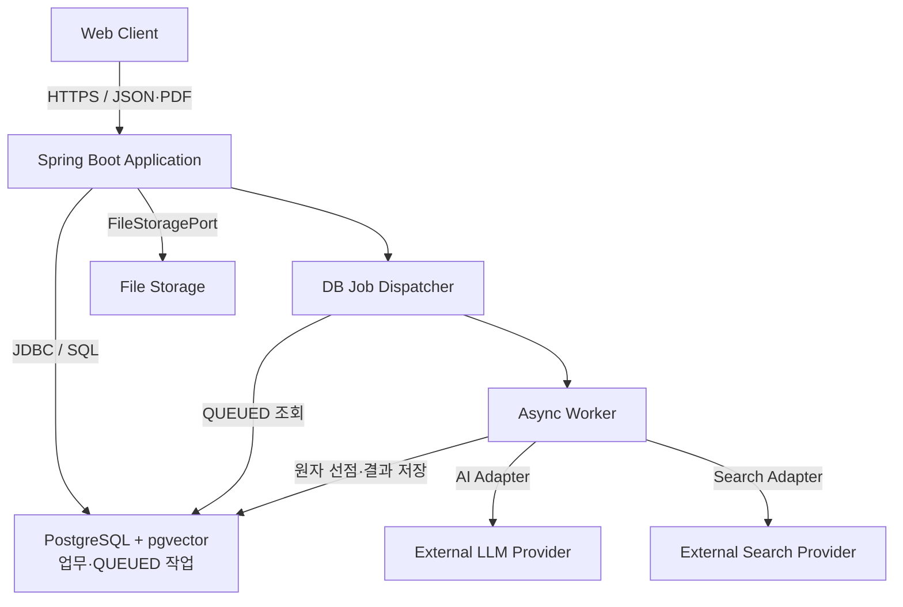
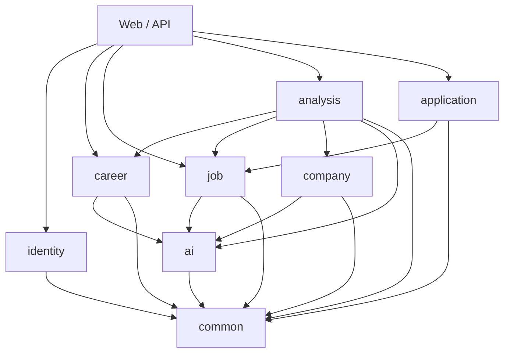
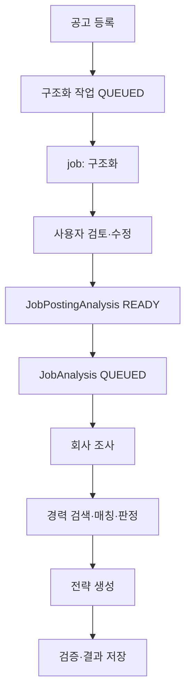
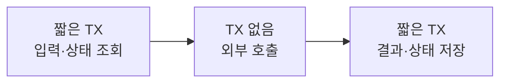

# AI 취업 지원 실행 플랫폼 MVP 초기 시스템 아키텍처 초안

- 문서 버전: v0.2
- 작성일: 2026-07-22
- 단계: 5/6 - 초기 시스템 아키텍처
- 기준 문서: 프로젝트 기획서 v0.2, 핵심 사용자 여정 및 유스케이스 v0.2, MVP 기능·비기능 요구사항 명세서 v0.2, 도메인·데이터 설계 초안 v0.2
- 구현 기준: Java 21, Spring Boot, PostgreSQL, pgvector, 모듈형 모놀리스
- 문서 목적: 개발 착수 전에 필요한 최소 구조·경계·실행 원칙 확정

## 0. 문서 결론

MVP는 하나의 Spring Boot 배포 단위 안에 업무 모듈을 분리한 **모듈형 모놀리스**로 시작한다. PostgreSQL과 pgvector를 하나의 데이터 저장 기반으로 사용하고, 긴 작업은 메시지 브로커 없이 **DB Job Dispatcher/Worker**로 처리한다. 공고 구조화는 `job` 모듈의 독립 Workflow이며, READY 결과만 `analysis` 모듈의 통제된 공고 분석 Workflow에 입력된다.

핵심 구조는 다음 원칙을 따른다.

1. `career`, `job`, `company`, `analysis`, `application`이 각자의 데이터와 규칙을 소유한다.
2. `analysis`는 다른 모듈의 공개 기능을 조합하지만 그 모듈의 데이터를 직접 수정하지 않는다.
3. AI와 외부 검색은 각각 Port/Adapter 경계 뒤에 둔다.
4. 서비스 내부 기능은 일반 Spring Service로 구현하며 MCP를 사용하지 않는다.
5. 회사 조사 실패는 경력 검색·판정을 막지 않는다.
6. 완료 또는 부분 완료 결과는 자동 저장한다.
7. 모든 사용자 소유 데이터 접근에 userId 범위를 적용한다.
8. 전체 경력 복사 대신 검색 후보 기록과 채택 근거 Snapshot만 보존한다.
9. `@Async`는 실행 수단일 뿐이며 작업 내구성의 기준 저장소는 DB다.
10. 외부 LLM·Embedding·Search 호출 중에는 DB 트랜잭션을 유지하지 않는다.

### 0.1 v0.2 변경 요약

| 구분 | v0.1 | v0.2 |
|---|---|---|
| 비동기 실행 | DB 실행 상태 저장 후 Executor 등록 중심 | DB의 QUEUED 작업을 Dispatcher가 재발견하고 Worker가 원자적으로 선점 |
| 공고 구조화 | JobAnalysis 내부 2단계에 포함 | job 모듈의 독립 JobPostingAnalysis Workflow로 분리 |
| 분석 입력 | 구조화 전 공고도 Workflow에서 처리 가능 | 사용자 확인을 거쳐 READY인 JobPostingAnalysis만 허용 |
| 회사 확인 | 분석 중 사용자 확인 가능 표현 존재 | READY 이전에 회사명·핵심 구조 확인, 분석 중 사용자 대기 없음 |
| 회사 조사 실패 | 제한사항으로 흡수 | 회사 식별 불확실도 실패/제한으로 저장하고 경력 판정 계속 |
| 경력 Vector | 생성·재임베딩 흐름만 기술 | PENDING / INDEXING / INDEXED / FAILED 상태와 교체 순서 명시 |
| 트랜잭션 | 저장 단위 중심 | 외부 호출 전후 짧은 트랜잭션, 판정·근거만 원자 저장 |
| 모듈 원칙 | ai/common 역할을 간략 정의 | ai의 기술 지원 성격, common 금지 항목, 최상위 탈퇴 조정 명확화 |

## 1. 아키텍처 목표

### 1.1 모듈형 모놀리스로 시작하는 이유

- 개인 개발자가 하나의 코드베이스·배포 단위·데이터베이스를 운영할 수 있어 개발과 장애 분석이 단순하다.
- 핵심 폐쇄 루프가 아직 제품 검증 단계이므로 서비스별 독립 배포보다 도메인 경계와 Workflow 정합성이 더 중요하다.
- 트랜잭션이 필요한 문서 저장, 후보 저장, 판정 결과 저장을 한 애플리케이션에서 안전하게 처리할 수 있다.
- 외부 LLM·검색처럼 실제 교체 가능성이 있는 지점만 Adapter로 분리해 과도한 추상화를 피할 수 있다.
- 모듈 경계를 코드와 테스트로 유지하면 향후 특정 부하나 조직 필요가 생겼을 때 분리할 선택지를 남길 수 있다.

모듈형 모놀리스는 단순한 계층형 단일 패키지를 뜻하지 않는다. 각 업무 모듈이 자신의 도메인 모델과 저장소를 소유하고, 다른 모듈은 공개된 Application Service 또는 조회 Port만 이용하는 구조를 뜻한다.

### 1.2 MVP에서 우선하는 품질 속성

| 우선순위 | 품질 속성 | MVP 기준 |
|---:|---|---|
| 1 | 데이터 격리·보안 | 모든 사용자 소유 데이터에 userId 범위와 소유권 검증 적용 |
| 2 | 결과 신뢰성 | 확정 경력만 사용, 근거 없는 충족 금지, Structured Output 검증 |
| 3 | 실패 격리 | 회사 조사 실패가 경력 판정을 중단하지 않음 |
| 4 | 데이터 무결성 | 상태 전이·Snapshot·자동 저장·부분 완료 경계 보장 |
| 5 | 관측 가능성 | 실행 ID로 단계·시간·실패·토큰·재시도 추적 |
| 6 | 구현·운영 단순성 | 단일 애플리케이션, 단일 DB, Docker Compose 우선 |
| 7 | 교체 가능성 | LLM·검색·파일 저장을 Port/Adapter로 격리 |
| 8 | 성능 | 일반 조회는 빠르게, 외부 호출 장기 작업은 비동기 처리 |

### 1.3 현재 단계에서 제외하는 구조

- 마이크로서비스와 서비스별 데이터베이스
- RabbitMQ·Kafka 등 메시지 브로커의 즉시 도입
- Kubernetes와 서비스 메시
- 이벤트 소싱·CQRS
- 범용 Workflow/BPM 엔진
- 자유형 Multi-Agent와 Agent Loop
- 서비스 내부 기능을 노출하는 MCP Server
- 단계별 독립 복구·성공 산출물 재사용을 위한 복잡한 실행 그래프
- 분산 캐시·분산 락·별도 벡터 데이터베이스

## 2. 전체 시스템 구성

### 2.1 구성요소와 책임

| 구성요소 | 책임 | 주요 통신 | 데이터 소유 여부 |
|---|---|---|---|
| Web Client | 문서·공고 입력, 후보 검토, 분석 요청·상태 폴링, 결과·지원 상태 표시 | Spring Boot와 HTTPS/JSON, PDF multipart 업로드 | 영속 데이터 없음. 인증 토큰·일시 UI 상태만 관리 |
| Spring Boot Application | 인증·소유권 검사, 도메인 규칙, 파일 처리 조정, Workflow 실행, 외부 Provider 연동 | Web Client와 HTTP, DB와 JDBC, 저장소·외부 Provider와 각 Adapter 프로토콜 | 업무 데이터의 생성·변경 책임 |
| PostgreSQL | 사용자·경력·공고·분석·상태·비동기 작업·관측 메타데이터 저장 | Spring Boot 내부 Repository를 통한 SQL/JDBC | 구조화 업무 데이터의 기준 저장소 |
| pgvector | 확정 경력 검색용 임베딩 저장과 사용자별 유사도 검색 | PostgreSQL 확장 기능으로 동일 연결 사용 | 파생 검색 데이터. 진실 원본은 CareerExperienceVersion |
| File Storage | PDF 원본과 필요 시 큰 추출 산출물 저장 | FileStoragePort를 통한 파일 스트림·키 기반 접근 | 바이너리 원본. 메타데이터와 소유권은 DB가 관리 |
| External LLM Provider | 문서 후보 추출, 공고 구조화, 요구사항 판정 보조, 전략 생성 | AiModelPort Adapter가 HTTPS API 호출 | 시스템 기준 데이터 소유 안 함 |
| External Search Provider | 회사 공식 도메인·공식 자료 후보 검색 | SearchProviderPort Adapter가 HTTPS API/Tool 호출 | 검색 결과 후보만 반환, 채택 출처는 DB 저장 |

### 2.2 통신 원칙

- 브라우저는 PostgreSQL·파일 저장소·외부 AI·검색 Provider에 직접 접근하지 않는다.
- Spring Boot만 데이터와 외부 연동의 신뢰 경계가 된다.
- 외부 호출에는 연결·응답 제한 시간, 제한 재시도, 실패 분류를 적용한다.
- PDF 업로드 자체는 HTTP 요청 안에서 검증·저장하고, 텍스트 추출 이후 작업은 비동기로 넘긴다.
- 비동기 실행 상태는 DB가 기준이며, Web Client는 작업 ID로 상태를 조회한다. MVP에서 WebSocket/SSE는 필수가 아니다.
- pgvector는 PostgreSQL과 같은 트랜잭션·백업 범위에 두되 Vector 레코드는 재생성 가능한 파생 데이터로 취급한다.

## 3. Spring Boot 내부 모듈 경계

### 3.1 공통 원칙

- 각 업무 모듈은 자신의 도메인 객체와 Repository를 소유한다.
- 다른 모듈의 Repository나 내부 엔티티를 직접 호출하지 않는다.
- 모듈 간 호출은 공개 Application Service, 명시적 Query Service 또는 Port로 제한한다.
- 공개 계약은 식별자와 필요한 읽기 모델 중심으로 구성하며 JPA 엔티티를 넘기지 않는다.
- `common`은 기술 공통 요소만 가지며 업무 규칙, 업무 enum, 범용 업무 DTO, 범용 Repository를 두지 않는다.
- `ai`는 업무 도메인이 아니라 기술 지원 모듈이다. 업무 판단과 상태 전이를 소유하지 않고 모델·임베딩 호출 기반 기능만 제공한다.

### 3.2 모듈별 책임

#### identity

- **책임:** 사용자 식별, 인증 경계, 현재 사용자 컨텍스트, 계정 상태, 소유권 판단 기반 제공
- **주요 도메인:** User
- **외부 제공 기능:** 현재 userId 제공, 인증 여부·계정 상태 확인, identity 소유 데이터 삭제 기능
- **의존 가능:** common
- **의존 금지:** career, job, company, analysis, application, ai
- **AI·외부 연동:** 없음. 인증 Provider를 선택할 경우 인증 Adapter만 별도 경계로 둠

#### career

- **책임:** 경력 문서·추출 실행·후보 검토·확정 경력 버전·근거·검색 문서와 색인 준비 상태 관리
- **주요 도메인:** CareerDocument, CareerDocumentAnalysis, CareerExtractionCandidate, CareerExperience, CareerExperienceVersion, ExperienceEvidence, CareerSearchDocument, CareerIndexStatus
- **외부 제공 기능:** 문서 업로드/분석 상태, 후보 수정·확정, 직접 입력 확정, 확정 경력 조회, 색인 요청·상태 확인, 사용자별 경력 검색, 검색 후보 상세 조회, 사용자 경력 삭제
- **의존 가능:** identity의 사용자 컨텍스트, ai, common, FileStoragePort
- **의존 금지:** job, company, analysis, application
- **AI·외부 연동:** 문서 후보 추출과 임베딩 생성은 ai를 통해 수행, 파일 저장은 FileStoragePort 사용

#### job

- **책임:** 채용공고 원문, 독립 공고 구조화 Workflow, 회사명·핵심 구조의 사용자 확인, 요구사항 관리
- **주요 도메인:** JobPosting, JobPostingAnalysis, JobRequirement
- **외부 제공 기능:** 공고 등록·조회, 구조화 요청·상태 조회, 사용자 검토·수정, READY 구조 버전과 요구사항 제공, 사용자 공고 삭제
- **의존 가능:** identity, ai, common
- **의존 금지:** career, company, analysis, application
- **AI·외부 연동:** 공고 구조화에 ai 사용. 검색 Provider 직접 호출 금지

#### company

- **책임:** 전역 Company 기준정보와 사용자·공고별 회사 공식 정보 조사 실행·출처 관리
- **주요 도메인:** Company, CompanyResearchRun, CompanySource
- **외부 제공 기능:** 회사 식별, 사용자 문맥별 조사 실행, 조사 상태·채택 공식 출처 제공
- **의존 가능:** identity, common, 외부 SearchProviderPort. 필요 시 ai의 구조화 기능
- **의존 금지:** career, analysis, application. job Repository 직접 접근 금지
- **AI·외부 연동:** 외부 검색 필수, 결과 요약·분류에 ai 사용 가능. 공식성 검증은 일반 로직과 출처 규칙 병행

#### analysis

- **책임:** READY 공고 분석 Workflow 순서 통제, 검색 후보 기록, 요구사항별 매칭·판정, 회사 정보 결합, 전략 생성, 결과·제한사항 자동 저장
- **주요 도메인:** JobAnalysis, SearchCandidateRecord, RequirementSnapshot, CompanySourceSnapshot, RequirementMatch, MatchEvidence, AnalysisLimitation
- **외부 제공 기능:** 분석 실행, 실행 상태 조회, 완료·부분 완료 결과 조회, 전체 재실행
- **의존 가능:** career·job·company의 공개 기능, ai, identity, common
- **의존 금지:** 다른 모듈 Repository 직접 접근, application에 대한 명령 의존
- **AI·외부 연동:** 판정·전략 생성에 ai 사용. 외부 검색은 company를 통해서만 수행

#### application

- **책임:** 공고별 현재 지원 상태의 생성·변경·목록 표시
- **주요 도메인:** Application
- **외부 제공 기능:** 첫 상태 설정, 현재 상태 변경·조회, 지원 목록 조회
- **의존 가능:** identity, job의 공고 소유권/존재 확인 공개 기능, common. 분석 결과 표시는 analysis의 읽기 기능을 조합할 수 있음
- **의존 금지:** career, company, ai, 다른 모듈 Repository
- **AI·외부 연동:** 없음

#### ai

- **책임:** 업무 도메인이 아닌 기술 지원 모듈로서 Prompt 실행 기반, 모델 호출, Structured Output 파싱·검증 지원, 임베딩 호출, 재시도·실패 분류·사용량 기록, Provider Adapter를 제공
- **주요 도메인:** 업무 도메인 없음. 호출 명세·결과·사용량·실패 분류 등 기술 모델
- **외부 제공 기능:** 구조화 생성, 텍스트 생성, 임베딩 생성의 Provider 독립 Port
- **의존 가능:** common
- **의존 금지:** identity, career, job, company, analysis, application
- **AI·외부 연동:** External LLM/Embedding Provider Adapter 소유

#### common

- **책임:** 공통 오류 형식, 요청 ID, 시간·ID 추상화, 기술 설정, 공통 관측 기반. 업무 규칙·업무 enum·범용 업무 DTO·범용 Repository는 포함하지 않음
- **주요 도메인:** 없음
- **외부 제공 기능:** 모듈에 중립적인 작은 기술 유틸리티
- **의존 가능:** 프레임워크·표준 라이브러리
- **의존 금지:** 모든 업무 모듈
- **AI·외부 연동:** 없음

### 3.3 권장 의존 방향

```text
Web/API
  -> identity
  -> career -> ai
  -> job -> ai
  -> company -> ai / SearchProviderPort
  -> analysis -> career / job / company / ai
  -> application -> job (필요 시 analysis 읽기)

모든 모듈 -> common
ai, common -> 업무 모듈 의존 금지
```

순환 의존 방지를 위해 `career`, `job`, `company`는 `analysis`를 모른다. 분석 완료 후 Application을 자동 생성하지 않으며, 사용자가 처음 상태를 지정할 때 `application`이 생성한다. 사용자 탈퇴처럼 여러 모듈을 함께 변경하는 작업은 특정 업무 모듈이 주도하지 않는다. Web/API보다 아래이면서 개별 업무 모듈보다 위인 **최상위 Application Orchestration 계층**이 identity, career, job, company, analysis, application의 공개 삭제 기능을 호출한다. 이 계층은 업무 데이터를 직접 저장하거나 각 모듈 Repository에 접근하지 않는다.

## 4. 공고 등록·구조화 Workflow

### 4.1 소유권과 통제 방식

`JobPostingAnalysis`는 `job` 모듈이 소유하는 별도 비동기 Workflow다. 공고 원문 저장과 구조화 실행을 분리하며, 구조화 결과는 사용자 검토·수정을 거쳐야 `READY`가 된다. 회사명과 핵심 공고 구조의 사용자 확인도 이 단계에서 끝낸다. `JobAnalysis` 실행 중에는 사용자 응답을 기다리는 상태를 만들지 않는다.

| 단계 | 입력 | 출력 | 실패·재실행 | 저장 경계 |
|---|---|---|---|---|
| 1. 공고 등록 | userId, 붙여넣은 공고 원문 | JobPosting | 입력 오류는 동기 거절. 원문 변경은 새 JobPosting 생성 | 짧은 트랜잭션으로 원문과 소유권 저장 |
| 2. 구조화 작업 생성 | JobPosting ID | QUEUED JobPostingAnalysis | 동일 입력의 진행 중 작업 중복 방지 | 짧은 트랜잭션으로 실행 레코드 저장 |
| 3. 구조화 실행 | 공고 원문 | 회사명, 직무, 업무, 요구사항 후보 | 외부 호출 실패·구조 오류는 제한 재시도 후 FAILED | 입력 조회 후 트랜잭션 종료 → 외부 LLM 호출 → 결과 저장 트랜잭션 |
| 4. 사용자 검토·수정 | 구조화 후보 | 확인된 회사명과 핵심 공고 구조 | 사용자가 저장 전까지 REVIEW_REQUIRED 유지 | 사용자 수정 내용을 짧은 트랜잭션으로 저장 |
| 5. READY 전환 | 검증된 구조와 필수 요구사항 | READY JobPostingAnalysis | 필수 구조 누락이나 회사명 미확인은 전환 거절 | 구조 버전·요구사항·READY 상태를 원자 저장 |

공식 도메인은 READY의 필수값으로 강제하지 않는다. 다만 회사명과 공고의 핵심 구조는 사용자가 확인해야 한다. 공식 도메인은 후속 회사 조사에서 식별하며, 식별 실패가 경력 판정을 중단시키지는 않는다.

## 5. 공고 분석 Workflow

### 5.1 통제 방식

`analysis`의 Workflow Orchestrator가 하나의 `JobAnalysis` 실행을 만들고 정해진 단계를 순서대로 호출한다. 입력은 반드시 사용자 소유의 `READY JobPostingAnalysis`다. `JobAnalysis.status`, `currentStep`, `failureCode`, `startedAt`, `completedAt`이 DB 기준 실행 상태이며 별도 `AnalysisStep` 엔티티와 자유형 Agent Loop는 만들지 않는다.

재실행은 기존 실행을 갱신하지 않고 새 `JobAnalysis`를 생성한다. MVP에서는 분석 중 사용자 대기, 단계별 독립 재실행, 성공 산출물 재사용을 하지 않는다.

### 5.2 단계별 설계

| 단계 | 입력 | 출력 | 실패 시 처리 | 자동 재시도 | 분석 계속 | 저장 시점 |
|---|---|---|---|---|---|---|
| 1. 입력 검증 | userId, READY JobPostingAnalysis, 색인 가능한 확정 경력 | 검증된 실행 컨텍스트 | 소유권·READY·확정 경력 부재는 FAILED. 색인 FAILED 경험은 재색인 안내와 제한 후보 | 없음 | 필수 입력 없으면 불가 | JobAnalysis 입력 버전·색인 상태 검증 결과 저장 |
| 2. 회사 조사 | 확인된 회사명, 공고 문맥 | CompanyResearchRun, 공식 출처 또는 제한사항 | 공식 도메인/회사를 확실히 식별하지 못하면 실패 또는 제한 상태와 AnalysisLimitation 저장 | 검색 일시 오류만 제한 | 가능 | 조사 상태·채택 출처 또는 실패 사유 저장 |
| 3. 경력 검색 | userId, JobRequirement별 질의, INDEXED 확정 경력 | 후보 ID·점수·순위 | 검색 장애는 제한 재시도 후 FAILED. FAILED 색인 경험은 제한사항 표시 | DB/임베딩 일시 오류 제한 | 검색 자체 실패 시 불가 | SearchCandidateRecord 저장 |
| 4. 요구사항별 매칭·판정 | RequirementSnapshot, 검색 후보, 경력 상세·근거 | 충족/부분 충족/확인 불가/미충족과 채택 근거 | 구조·불변조건 오류는 제한 재시도. 근거 부족은 확인 불가 | 제한 재시도 | 판정·근거 저장 가능 시 가능 | RequirementMatch와 MatchEvidence를 하나의 짧은 트랜잭션으로 원자 저장 |
| 5. 전략 생성 | 판정·채택 경력·회사 출처·제한 | 강점, 확인 항목, 지원 근거, 준비 전략 | 실패해도 판정·근거가 저장됐으면 PARTIALLY_COMPLETED | 일시·구조 오류 제한 | 가능 | 결과 단위 저장, 실패 시 AnalysisLimitation 저장 |
| 6. 결과 검증·저장 | 전체 판정·근거·전략·출처·Snapshot | COMPLETED 또는 PARTIALLY_COMPLETED | 불변조건 위반은 완료 금지. 최종 DB 저장 실패는 FAILED | AI 출력 문제면 제한 재생성, DB는 멱등 범위만 | 불가 | Snapshot·제한사항·최종 상태·종료 시각 저장 |

각 단계는 외부 호출 여부와 관계없이 Orchestrator가 순서를 결정한다. 회사 조사 실패는 회사 관련 지원 근거를 제한하지만, 경력 검색과 요구사항별 판정은 계속한다.

### 5.3 DB 트랜잭션 경계

외부 LLM, Embedding, Search Provider 호출 중에는 DB 트랜잭션을 유지하지 않는다. 각 Workflow 단계는 원칙적으로 다음 세 구간으로 나눈다.

1. 짧은 트랜잭션으로 입력, 소유권, 현재 상태를 조회하고 필요한 불변조건을 확인한다.
2. 트랜잭션을 종료한 뒤 외부 Provider를 호출한다.
3. 짧은 새 트랜잭션으로 결과, 실패 정보, 다음 상태를 저장한다.

`RequirementMatch`와 그 `MatchEvidence`처럼 함께 성공하거나 실패해야 하는 저장 범위만 하나의 트랜잭션으로 묶는다. 외부 호출 실패는 이미 종료된 조회 트랜잭션과 분리되므로 장시간 열린 DB 트랜잭션의 Rollback으로 이어지지 않는다. 외부 호출 이후 저장 전 입력 버전이나 상태가 바뀌었는지는 저장 트랜잭션에서 다시 확인하며, 불일치하면 결과를 확정하지 않는다.

### 5.4 완료 의미

- `COMPLETED`: 요구사항별 판정과 근거, 필수 결과가 조회 가능하다. 회사 조사 실패는 제한사항이 명시되면 COMPLETED를 허용한다.
- `PARTIALLY_COMPLETED`: 모든 생성 대상 RequirementMatch와 근거 저장에는 성공했으나 후속 지원 판단·전략 일부가 실패했다.
- `FAILED`: 판정·근거 최소 저장 경계에 도달하지 못했거나 최종 저장에 실패했다.

## 6. 동기·비동기 처리 구분

| 기능 | 분류 | 이유와 MVP 처리 |
|---|---|---|
| 경력 문서 업로드 | 동기 | 파일 형식·10MB·50페이지·암호화 여부를 검증하고 원본 저장 성공까지 응답해야 함. 이후 작업 ID 반환 |
| PDF 텍스트 추출 | 비동기 | 페이지 수와 파서 처리 시간이 가변적이며 실패 시 붙여넣기 대체가 필요 |
| 경력 후보 추출 | 비동기 | 외부 LLM 호출과 검증·재시도가 포함됨 |
| 채용공고 저장 | 동기 | 붙여넣기 입력 검증과 원문 저장은 짧고 즉시 성공 여부가 필요 |
| 채용공고 구조화 | 비동기 | LLM 호출·Structured Output 검증이 포함됨 |
| 회사 정보 조사 | 비동기 | 외부 검색 지연·실패·복수 결과 검증이 발생 |
| 공고 분석 | 비동기 | 검색·LLM·여러 단계·자동 저장을 포함하는 장기 작업 |
| 분석 결과 조회 | 동기 | 저장된 결과와 상태 조회이며 외부 호출을 하지 않음 |
| 지원 상태 변경 | 동기 | 단일 현재 상태 검증·저장으로 즉시 결과 필요 |

### 6.1 MVP 비동기 실행 권장안: DB Job Dispatcher/Worker

모든 내구성 작업은 업무 실행 레코드를 DB에 `QUEUED`로 먼저 저장하고 커밋한다. 주기적으로 실행되는 Dispatcher가 DB에서 실행 가능한 QUEUED 작업을 조회하며, Worker는 조건부 상태 갱신으로 작업을 `PROCESSING` 또는 `RUNNING`으로 원자 선점한 뒤 실행한다.

1. 요청 트랜잭션이 CareerDocumentAnalysis, JobPostingAnalysis, CompanyResearchRun 또는 JobAnalysis를 QUEUED로 저장한다.
2. Dispatcher가 일정 주기로 유형별 QUEUED 작업을 조회한다.
3. Worker가 `현재 상태가 QUEUED일 때만` 상태를 갱신해 선점한다. 갱신 성공 Worker만 실행 권한을 갖는다.
4. Worker는 외부 호출과 단계 저장을 수행하고 종료 상태를 기록한다.
5. 애플리케이션 종료로 메모리 Executor 등록이 누락되거나 실행 전 프로세스가 중단돼도 DB의 QUEUED 레코드는 다음 Dispatcher 주기에 다시 발견된다.

단일 인스턴스 MVP에서는 간단한 조건부 상태 갱신과 작은 batch 조회로 시작한다. `@Async` 또는 제한된 Executor는 선점된 작업을 병렬 실행하는 수단으로 사용할 수 있지만, 작업 내구성·대기 여부·재발견의 기준 저장소는 DB다. 요청 직후 Executor에 실행 ID를 전달하는 최적화는 허용하되 Dispatcher를 대체하지 않는다.

- **중복 제어:** 같은 사용자·대상·입력 버전의 진행 중 실행을 DB 제약과 조건부 상태 갱신으로 차단한다.
- **정체 작업:** Worker heartbeat 또는 선점 시각 정책은 구현 중 정하되, 장시간 PROCESSING/RUNNING 작업은 무조건 재실행하지 않고 멱등성 확인 후 재큐잉 또는 실패 처리한다.
- **동시성 제한:** 작업 유형별 Worker 동시 실행 상한과 Dispatcher batch 크기를 둔다.
- **다중 인스턴스 전환:** 두 개 이상의 인스턴스가 같은 작업 테이블을 소비할 때는 `SELECT FOR UPDATE SKIP LOCKED` 같은 DB 선점 방식, lease/heartbeat, 중복 실행 멱등성을 함께 검토한다.

### 6.2 메시지 브로커 도입 기준

RabbitMQ 또는 Kafka는 다음 조건 중 복수 항목이 실제 측정으로 나타날 때 검토한다.

- 작업 유실 없는 내구성 큐와 높은 처리량이 필요하고 DB 폴링이 병목이 됨
- 애플리케이션 인스턴스가 여러 개가 되어 작업 선점·재분배가 복잡해짐
- 작업 종류별 독립 소비자 확장과 backpressure가 필요함
- 긴 backlog, 재시도, DLQ를 운영자가 별도로 관리해야 함
- 외부 AI Provider rate limit 때문에 세밀한 소비 속도 제어가 필요함
- 모듈이 실제 독립 배포 단위로 분리됨

단순히 비동기 작업이 존재한다는 이유만으로 메시지 브로커를 도입하지 않는다. 도입 시에도 Kafka는 이벤트 스트림·재처리 요구가 있을 때, RabbitMQ는 명시적 작업 큐·라우팅이 필요할 때 비교한다.

## 7. AI 연동 구조

### 7.1 책임 분리

| 책임 | 소유 위치 | 원칙 |
|---|---|---|
| Prompt 구성 | 각 업무 모듈의 AI Use Case 또는 Prompt 정책 | career/job/analysis가 업무 맥락을 구성하고 ai가 Provider 형식으로 변환 |
| Structured Output 검증 | 1차 ai 공통 검증, 2차 호출 업무 모듈 검증 | JSON/schema 검증과 도메인 불변 조건 검증을 분리 |
| 재시도 | ai 호출 정책 | 네트워크·rate limit·구조 오류 등 재시도 가능 유형만 제한 횟수 수행 |
| 모델 호출 | Provider Adapter | 인증·엔드포인트·Provider 요청/응답 형식 캡슐화 |
| 응답 파싱 | ai | Provider 응답을 내부 중립 결과로 변환 |
| 실패 분류 | ai | timeout, rate limit, provider error, invalid structure, policy rejection 등 표준 분류 |
| 비용·토큰 기록 | ai + 관측성 | 실행 ID·호출 목적·Provider·토큰·예상 비용 메타데이터 저장/기록 |
| Provider Adapter | ai 인프라 경계 | Spring AI 또는 직접 SDK/HTTP 구현을 감싸며 업무 모듈에 Provider 타입 노출 금지 |

### 7.2 호출 계약

- 텍스트 생성과 임베딩 호출 Port를 분리한다.
- 호출 요청에는 requestId, user pseudonym 또는 userId, analysisRunId, purpose, promptVersion을 포함하되 원문은 운영 로그에 남기지 않는다.
- Provider Adapter는 업무 판정 상태를 결정하지 않는다. 예를 들어 회사 조사 실패 후 계속할지는 Workflow가 결정한다.
- 구조 검증을 통과하지 않은 응답은 업무 엔티티로 확정 저장하지 않는다.
- 모델·프롬프트·Workflow 버전은 실행 메타데이터에 기록하되 동일 출력 재생성을 보장하지 않는다.
- Spring AI 사용 여부는 구현 직전에 결정한다. 선택하더라도 업무 모듈이 Spring AI 타입에 직접 결합되지 않도록 내부 Port를 둔다.

## 8. RAG 검색 구조

### 8.1 처리 흐름

1. 사용자가 CareerExtractionCandidate를 수정·확정하거나 직접 입력 경험을 명시적으로 확정한다.
2. CareerExperienceVersion이 생성된다. DOCUMENT는 ExperienceEvidence가 1개 이상이며 USER_DIRECT는 Evidence를 강제하지 않는다.
3. 해당 버전의 색인 상태를 `PENDING`으로 저장하고 비동기 색인 작업을 QUEUED로 등록한다.
4. Worker가 작업을 선점하면 상태를 `INDEXING`으로 바꾸고 경험 제목·역할·수행 내용·문제·행동·성과·기술을 조합해 검색 문서를 만든다.
5. DB 트랜잭션을 닫은 상태에서 ai의 EmbeddingPort를 호출한다.
6. 임베딩 성공 시 짧은 트랜잭션으로 CareerSearchDocument와 pgvector 값, userId·experienceVersionId·metadata를 저장하고 `INDEXED`로 전환한다. 최종 실패 시 `FAILED`와 실패 사유를 저장한다.
7. 공고 분석 전 사용자에게 색인 가능한 확정 경력이 존재하는지, 사용할 버전이 INDEXED인지, FAILED 경험이 있는지 검증한다.
8. 각 JobRequirement별 검색에서 userId, 현재 확정 버전, INDEXED, 활성·미삭제 조건을 필터링한다.
9. 유사도 상위 후보를 반환하고 SearchCandidateRecord에 경력 버전 ID·점수·순위를 저장한다.
10. Workflow가 후보의 실제 내용과 근거를 조회해 판정 후보로 사용하고, 최종 채택 경력만 MatchEvidence와 표시용 Snapshot으로 보존한다.

### 8.2 검색과 판정의 경계

- Vector 유사도는 관련성 후보 선별 값이지 충족 판정 점수가 아니다.
- 검색 결과가 없으면 자동 미충족으로 판정하지 않고 원칙적으로 확인 불가를 검토한다.
- 충족·부분 충족에는 채택된 확정 경력 근거가 필요하다.
- 미충족은 사용자 확정 정보와 공고 조건의 명시적 충돌 근거가 있을 때만 허용한다.
- LLM은 검색 후보 밖의 경험을 사용자 보유 사실로 추가할 수 없다.
- 합격 확률, 임의 점수·등급은 생성하지 않는다.

### 8.3 색인 상태와 변경·삭제

| 상태 | 의미 | 다음 상태 | 분석 영향 |
|---|---|---|---|
| PENDING | 확정 버전이 생성됐으나 색인 Worker가 아직 선점하지 않음 | INDEXING | 아직 검색 대상 아님 |
| INDEXING | 검색 문서 생성·Embedding·저장을 수행 중 | INDEXED 또는 FAILED | 아직 검색 대상 아님 |
| INDEXED | 활성 검색 문서와 Vector 저장 성공 | 새 버전 생성 시 기존 문서 비활성화 대상 | 검색 가능 |
| FAILED | 제한 재시도 후 색인 실패 | 재실행 시 PENDING | 분석 제한사항 표시, 검색 대상 제외 |

MVP는 FAILED 경험의 **색인 재실행과 분석 제한사항 표시**를 우선한다. 키워드 검색이나 원문 전수 비교 같은 복잡한 fallback 검색은 후순위다. INDEXED 경력이 한 건도 없으면 분석을 시작하지 않으며, 일부 경험만 FAILED이고 다른 INDEXED 경험이 있으면 실패 경험을 AnalysisLimitation으로 알리고 분석을 계속할 수 있다.

- 확정 경력 수정은 새 CareerExperienceVersion을 만들고 PENDING에서 색인을 시작한다. **새 버전이 INDEXED로 전환된 같은 짧은 저장 경계에서 이전 버전 검색 문서를 비활성화**한다. 새 색인이 실패하면 이전 검색 문서는 활성 상태를 유지하되, 현재 확정 버전과 검색 버전 불일치를 표시하고 재색인을 우선한다.
- 일반 삭제된 경력은 현재 검색에서 즉시 제외한다.
- 완전 삭제 시 경력 Vector, 검색 후보 기록, 채택 경력 Snapshot을 사용자 분석 데이터와 함께 물리 삭제한다.
- 경험 1건을 기본 임베딩 단위로 사용한다. 길이 제한이나 의미 구획 문제가 실제로 발생할 때만 chunking을 추가한다.

## 9. 파일 저장 구조

### 9.1 대안 비교

| 대안 | 장점 | 한계 | 적합 환경 |
|---|---|---|---|
| 로컬 파일 저장 | 설정이 가장 단순하고 디버깅 쉬움 | 컨테이너 재생성·서버 이동 시 유실 위험, 다중 인스턴스 부적합 | IDE 기반 초기 개발·테스트 |
| Docker Volume | Compose 환경에서 영속성 확보, 별도 서비스 불필요 | 백업·이관·권한 관리가 호스트에 종속, 단일 서버 중심 | 로컬 통합·초기 단일 서버 배포 |
| S3 호환 Object Storage | 내구성·확장성·백업·수명주기 관리에 유리 | 인증·비용·네트워크·로컬 개발 설정 증가 | 외부 사용자 운영·다중 인스턴스 |

### 9.2 MVP 권장안

- 개발: 로컬 디렉터리를 사용하는 LocalFileStorageAdapter
- Docker Compose 통합/초기 단일 서버: 같은 Adapter가 가리키는 Docker Volume
- 실제 외부 사용자 운영: 운영 위험을 검토한 뒤 S3 호환 Adapter 우선 검토

업무 코드는 `FileStoragePort`의 저장·읽기·삭제 기능만 사용한다. DB에는 storage key, 원본명, 크기, 콘텐츠 유형, checksum, userId 등 메타데이터를 저장하고 물리 경로·bucket SDK 타입은 노출하지 않는다.

파일 다운로드는 먼저 DB에서 userId 소유권을 확인한 뒤 짧은 수명의 스트림 또는 URL을 제공한다. 사용자가 전달한 파일명을 경로로 직접 사용하지 않으며, 파일 확장자만 믿지 않고 PDF 구조·암호화·페이지·크기를 검증한다.

## 10. 인증과 사용자 데이터 격리

### 10.1 인증 경계

가입·로그인의 구체 방식은 개발 시작 전에 확정하되, Spring Security 기반 인증 필터가 요청을 검증하고 `CurrentUser` 형태로 userId를 Application Service에 제공하는 경계를 둔다. 업무 서비스가 클라이언트가 보낸 userId를 신뢰해서는 안 된다.

### 10.2 데이터 분류

| 데이터 | 소유 범위 |
|---|---|
| Company | 전역 공유 가능. 공식명·공식 도메인 등 개인 문맥 없는 기준정보만 포함 |
| CareerDocument 및 분석·후보·경력·Vector | 사용자 소유 |
| JobPosting 및 구조화 결과 | 사용자 소유 |
| CompanyResearchRun, CompanySource | 사용자·공고 문맥 소유 |
| JobAnalysis와 모든 Snapshot·판정·제한사항 | 사용자 소유 |
| Application | 사용자 소유 |

### 10.3 Repository·Service 검증 원칙

1. 사용자 소유 Aggregate 조회 메서드는 기본적으로 id만 받지 않고 userId와 id를 함께 받는다.
2. 목록·검색·Vector 쿼리·비동기 작업 선점에도 userId 범위를 적용한다.
3. Service는 요청 대상과 연관 대상의 userId 일치를 검증한다.
4. 다른 모듈의 공개 조회도 소유권 검증을 생략하지 않는다.
5. 존재하지만 다른 사용자 소유인 데이터는 불필요한 존재 정보가 노출되지 않도록 찾을 수 없음과 동일하게 처리한다.
6. CompanyResearchRun의 userId는 Company가 전역이라는 이유로 생략하지 않는다.
7. 테스트에는 사용자 A의 ID로 사용자 B의 문서·경력·공고·분석·파일·Vector에 접근하는 부정 시나리오를 포함한다.
8. 완전 삭제 작업도 userId로 전체 범위를 고정하고 전역 Company는 개인 문맥이 없을 때만 유지한다.

DB Row Level Security는 MVP 필수로 확정하지 않는다. 우선 Repository 계약·Service 검증·통합 테스트로 보장하고, 운영 위험이나 다중 접근 경로가 늘면 방어층으로 재검토한다.

## 11. 상태 및 실패 처리

### 11.1 상태 모델의 시스템 관리

| 모델 | 상태 | 관리 원칙 |
|---|---|---|
| CareerDocumentAnalysis | QUEUED, PROCESSING, SUCCEEDED, FAILED | SUCCEEDED는 후보 생성·저장 성공이며 사용자 확정 완료가 아님 |
| CareerExtractionCandidate | REVIEW_REQUIRED, CONFIRMED, REJECTED | 후보 검토 여부의 유일한 기준. 미확정 후보는 분석 근거 사용 금지 |
| JobPostingAnalysis | QUEUED, PROCESSING, REVIEW_REQUIRED, READY, FAILED | job 소유 독립 Workflow. 회사명·핵심 구조를 사용자 확인한 READY만 공고 분석 입력 가능 |
| CompanyResearchRun | QUEUED, PROCESSING, SUCCEEDED, FAILED | FAILED도 JobAnalysis의 제한사항으로 흡수하고 분석 계속 가능 |
| JobAnalysis | QUEUED, RUNNING, COMPLETED, PARTIALLY_COMPLETED, FAILED | Dispatcher/Worker 실행. currentStep·failureCode·시각으로 진행 관리하고 사용자 대기 상태는 없음 |
| Application | 관심, 지원 예정, 지원 완료, 면접 진행, 보류, 지원하지 않음 | 처음 상태 지정 시 생성, MVP는 현재 상태만 저장 |

### 11.2 실패 분류

| 실패 유형 | 예시 | 처리·사용자 노출 | 재시도 |
|---|---|---|---|
| 사용자 입력 오류 | 용량·페이지 초과, 암호화 PDF, 공고 본문 부족 | 외부 호출 전 거절, 수정 방법 안내 | 자동 없음 |
| 문서 파싱 실패 | PDF 텍스트 추출 실패 | CareerDocumentAnalysis FAILED, 텍스트 붙여넣기 제공 | 동일 파일 자동 반복보다 사용자 대체 입력 |
| LLM 호출 실패 | timeout, rate limit, Provider 5xx | 실행과 단계에 분류 기록, 원본 보존 | 일시 오류만 제한 |
| Structured Output 검증 실패 | 필수 필드·허용 enum·스키마 위반 | 업무 데이터 확정 저장 금지 | 수정 Prompt로 제한 횟수 |
| 외부 검색 실패 | Search Provider 장애, 공식 도메인 불명확 | CompanyResearchRun FAILED, AnalysisLimitation 표시, 경력 판정 계속 | 일시 오류만 제한 |
| 데이터 저장 실패 | DB·파일 저장 실패, 무결성 충돌 | 완료 상태 전환 금지, 트랜잭션 롤백, 운영 오류 기록 | 멱등성이 보장되는 짧은 제한 재시도 |
| 분석 일부 제한 | 회사 자료 없음, 전략 생성 실패 | COMPLETED+제한 또는 PARTIALLY_COMPLETED로 조회 가능 결과 제공 | 전체 분석 재실행은 사용자 요청 |

재시도 횟수·backoff는 작업 종류별 설정값으로 둔다. 무제한 재시도는 금지하며 최종 실패 유형과 횟수를 기록한다.

## 12. 관측성

### 12.1 최소 기록 항목

| 항목 | 기록 위치·용도 |
|---|---|
| 요청 ID | 모든 HTTP·비동기 진입 로그의 상관관계 |
| 사용자 식별자 | 로그에는 가능하면 비식별/해시 식별자, 권한 검증에는 실제 userId |
| 분석 실행 ID | documentAnalysisId, jobPostingAnalysisId, researchRunId, jobAnalysisId |
| 단계 | currentStep 또는 작업 유형 |
| 실행 시간 | 전체·외부 호출·주요 단계 소요 시간 |
| 실패 유형 | 표준 failureCode와 재시도 가능 여부 |
| LLM Provider | Provider 식별자와 모델 배포 식별정보 |
| 토큰 사용량 | 입력·출력·합계, 호출 목적별 집계 |
| 검색 결과 수 | 검색 후보 수, 공식 자료 후보·채택 수 |
| 재시도 횟수 | 호출과 실행별 시도 횟수 |

### 12.2 로그·메트릭 원칙

- 문서 원문, 추출 전체 텍스트, 공고 원문, Prompt 전체, LLM 전체 응답, 인증 토큰을 운영 로그에 기본 저장하지 않는다.
- 오류 재현이 필요하면 접근 통제된 별도 저장과 짧은 보존 기간을 정책으로 확정한 뒤 선택적으로 사용한다.
- 로그에는 길이, 해시, 버전, 상태, 식별자 같은 최소 메타데이터를 남긴다.
- requestId와 실행 ID를 함께 기록해 HTTP 요청이 끝난 뒤 수행되는 비동기 작업도 연결한다.
- MVP 지표는 성공/실패 수, 단계별 지연, QUEUED backlog, 작업 대기 시간, 진행 중 작업 수, 재발견·재선점 수, LLM 토큰, 외부 오류율부터 시작한다.
- 개인 개발 MVP에서는 별도 관측 스택을 필수화하지 않고 구조화 로그와 Spring Actuator/Micrometer 수준으로 시작할 수 있다.

## 13. 배포 구성 초안

### 13.1 로컬·개발 환경

Docker Compose의 최소 서비스는 다음과 같다.

1. Spring Boot Application
2. PostgreSQL + pgvector 확장
3. Web Client
4. 파일 저장용 Volume

외부 LLM·검색 Provider는 Compose 밖의 관리형 API를 호출한다. 비밀정보는 환경 변수 또는 로컬 비밀 파일로 주입하고 저장소에 커밋하지 않는다.

### 13.2 초기 배포 권장

- Spring Boot와 Web Client는 각각 컨테이너로 배포할 수 있으나 하나의 호스트·네트워크에서 시작한다.
- PostgreSQL은 데이터 Volume과 정기 백업 대상을 명확히 한다. 외부 사용자 운영 시 관리형 PostgreSQL도 대안이다.
- 파일은 초기 단일 서버에서는 Volume을 사용할 수 있지만 서버 장애·백업 책임을 감수해야 한다. 외부 사용자 공개 전 Object Storage 전환을 우선 검토한다.
- TLS 종료, 도메인, CORS, 비밀정보, 백업·복구, 로그 보존은 배포 직전 확정한다.
- Kubernetes는 MVP에서 제외한다.

## 14. Mermaid 아키텍처 다이어그램

### 14.1 전체 시스템 구성도



Dispatcher와 Worker는 별도 서비스가 아니라 동일 Spring Boot Application 내부의 실행 구성요소다. 다이어그램에서는 DB가 작업 내구성의 기준이라는 점을 드러내기 위해 논리적으로 분리해 표현했다.

### 14.2 Spring Boot 내부 모듈 관계도



다이어그램은 허용 의존만 표현한다. `career`, `job`, `company`가 `analysis`를 역참조하거나 `ai`가 업무 모듈을 참조하는 방향은 금지한다.

### 14.3 공고 구조화와 공고 분석 Workflow



### 14.4 Workflow 단계의 트랜잭션 경계



## 15. 주요 아키텍처 결정 기록

### ADR-001 모듈형 모놀리스

- **결정:** 단일 Spring Boot 배포 단위 안에서 업무 모듈 경계를 유지한다.
- **이유:** 개인 개발·배포·트랜잭션·장애 분석 단순화, 핵심 흐름의 빠른 검증
- **대안:** 계층형 모놀리스, 마이크로서비스
- **선택하지 않은 이유:** 계층형 모놀리스는 업무 경계가 쉽게 무너지고, 마이크로서비스는 분산 트랜잭션·배포·관측 비용이 과도함
- **향후 재검토 조건:** 독립 확장 부하, 독립 배포 필요, 팀 소유권 분리, 모듈 간 장애 격리 필요가 측정으로 확인됨

### ADR-002 PostgreSQL + pgvector

- **결정:** 업무 데이터와 경력 Vector를 PostgreSQL에 함께 저장한다.
- **이유:** 단일 운영 기반, 사용자 필터와 관계 데이터 결합, MVP 검색 규모에 충분
- **대안:** 별도 Vector DB, 전문 검색엔진
- **선택하지 않은 이유:** 운영 요소와 동기화 복잡성이 증가하며 현재 규모·기능에서 이점이 검증되지 않음
- **향후 재검토 조건:** Vector 규모·지연·검색 기능이 pgvector 한계를 실제로 초과함

### ADR-003 비동기 처리 방식

- **결정:** DB 실행 레코드를 내구성 기준으로 삼고 Dispatcher가 QUEUED 작업을 반복 조회하며 Worker가 원자적으로 선점한다. `@Async`/Executor는 선점 후 실행 수단으로만 사용한다.
- **이유:** 요청 이후 메모리 등록이 누락되거나 애플리케이션이 종료돼도 QUEUED 작업을 다시 발견할 수 있고, 브로커 없이 MVP 수준의 내구성을 확보할 수 있음
- **대안:** 요청 내 동기 처리, DB 기록 후 Executor 직접 등록만 사용, 메시지 브로커, 범용 Workflow 엔진
- **선택하지 않은 이유:** 동기는 timeout 위험, Executor 등록만으로는 종료 시 작업 유실 가능, 브로커·Workflow 엔진은 현재 규모에 과도함
- **향후 재검토 조건:** 다중 인스턴스가 되면 `SELECT FOR UPDATE SKIP LOCKED`·lease·heartbeat를 검토하고, DB 폴링 병목·긴 backlog·독립 소비자 확장이 실제 발생하면 메시지 브로커를 재검토

### ADR-004 외부 LLM Adapter

- **결정:** 업무 모듈과 Provider 사이에 내부 AI Port와 Provider Adapter를 둔다.
- **이유:** Provider 형식·인증·오류를 격리하고 업무 규칙과 상태 전이를 보호함
- **대안:** 각 Service에서 SDK 직접 호출, 단일 Provider 전용 구현
- **선택하지 않은 이유:** 테스트·교체·공통 관측·실패 분류가 어려워짐
- **향후 재검토 조건:** 없음. 구체 추상화 깊이는 Provider 수와 실제 차이에 따라 축소·확장

### ADR-005 외부 검색 Adapter

- **결정:** company 모듈이 SearchProviderPort를 통해 검색한다.
- **이유:** 검색 제품을 미확정 상태로 유지하고 회사 조사 실패를 Workflow에서 격리함
- **대안:** 특정 검색 API 직접 결합, 브라우저 자동화 중심
- **선택하지 않은 이유:** 제품 종속성과 실패 처리 복잡성이 업무 코드로 전파됨
- **향후 재검토 조건:** 선택 Provider의 고유 기능이 핵심 제품 기능이 되거나 복수 검색원 조합이 필요함

### ADR-006 File Storage Port

- **결정:** Local/Volume/Object Storage 구현을 교체 가능한 FileStoragePort로 감싼다.
- **이유:** 개발 단순성과 운영 내구성 요구를 단계별로 충족함
- **대안:** DB BLOB, 물리 경로 직접 사용, 처음부터 특정 Object Storage 고정
- **선택하지 않은 이유:** DB 비대화, 경로 결합, 초기 설정 비용 또는 제품 종속성이 큼
- **향후 재검토 조건:** 외부 사용자 운영, 다중 인스턴스, 백업·수명주기 요구 발생

### ADR-007 MCP 제외

- **결정:** MVP 서비스 내부 구조에 MCP Server/Client를 포함하지 않는다.
- **이유:** 내부 기능은 타입이 명확한 Spring Service 호출이 더 단순하고 안전함
- **대안:** 내부 Tool을 MCP로 노출해 AI가 호출
- **선택하지 않은 이유:** 네트워크·스키마·권한·관측 복잡성만 증가하고 자유형 호출도 제품 원칙과 맞지 않음
- **향후 재검토 조건:** GitHub·Calendar 등 외부 도구 연동이 제품 범위에 포함되고 MCP가 적절한 표준 경계가 됨

### ADR-008 메시지 브로커 보류

- **결정:** RabbitMQ·Kafka 도입을 보류한다.
- **이유:** 단일 인스턴스·낮은 초기 작업량에서 DB 상태 관리로 충분함
- **대안:** RabbitMQ 작업 큐, Kafka 이벤트 스트림
- **선택하지 않은 이유:** 운영·재처리·관측 요소가 늘며 현재 문제를 해결하는 데 필요하지 않음
- **향후 재검토 조건:** 6.2의 backlog·다중 소비자·내구성·독립 확장 기준 충족

### ADR-009 통제된 Workflow Orchestrator

- **결정:** job은 공고 구조화 Workflow를, analysis는 READY 공고 분석 Workflow를 각각 고정 단계로 통제한다.
- **이유:** 사용자 확인이 필요한 공고 준비와 사용자 대기가 없어야 하는 분석 실행을 분리하고, 근거 제약·부분 완료 경계·회사 조사 실패 격리를 결정적으로 적용할 수 있음
- **대안:** 자유형 Agent Loop, 범용 Workflow 엔진
- **선택하지 않은 이유:** 실행 예측·비용·테스트·재현성 저하 또는 MVP 과설계
- **향후 재검토 조건:** 분기·대기·보상·장기 실행이 크게 늘어 코드 기반 상태 관리가 유지 불가능해짐

### ADR-010 외부 호출과 DB 트랜잭션 경계

- **결정:** Workflow 단계는 짧은 입력 조회 트랜잭션, 트랜잭션 밖 외부 호출, 짧은 결과 저장 트랜잭션으로 분리한다. RequirementMatch와 MatchEvidence 등 원자성이 필요한 저장만 함께 묶는다.
- **이유:** 느리거나 실패할 수 있는 LLM·Embedding·Search 호출이 DB 연결과 락을 오래 점유하거나 장시간 트랜잭션 Rollback을 유발하지 않도록 함
- **대안:** 단계 전체를 하나의 트랜잭션으로 처리, 외부 호출 결과를 저장 없이 메모리에서만 연결
- **선택하지 않은 이유:** 장기 트랜잭션은 락·연결 고갈·복구 범위를 키우고, 메모리만 사용하면 중단 시 진행 상태와 결과를 잃음
- **향후 재검토 조건:** 외부 호출이 없는 순수 DB 단계에는 더 넓은 트랜잭션을 허용할 수 있으나 외부 호출 중 트랜잭션 금지 원칙은 유지

## 16. 개발 시작 전 확정 사항

### 16.1 개발 시작 전에 반드시 확정할 항목

1. 인증 방식의 최소안: 자체 계정/세션 또는 토큰 기반, 비밀번호 저장·로그아웃 경계
2. 모듈 경계 검증 방식: 빌드/테스트에서 금지 의존을 확인하는 원칙
3. 로컬·Compose 파일 저장 루트와 원본 파일 접근 권한
4. Dispatcher 조회 주기·batch 크기, Worker 동시 실행 상한, 원자 선점 조건, 정체 PROCESSING/RUNNING 작업 복구 기준
5. DB 마이그레이션·초기 pgvector 확장 활성화 방식
6. 개발 환경의 비밀정보 주입과 커밋 금지 규칙
7. 요청 ID·실행 ID·failureCode의 공통 표현 원칙
8. 트랜잭션 경계: 외부 호출 전후 분리, 실행 생성, 판정·근거 일괄 저장, 완료 상태 전환
9. JobPostingAnalysis READY 전환에 필요한 회사명·핵심 구조의 최소 확인 항목
10. 색인 가능한 확정 경력의 최소 기준, 일부 FAILED 색인 상태에서 분석 계속 여부와 사용자 표시 문구

이미 도메인 문서에서 확정된 PDF 10MB·50페이지, 암호화·손상 거절, 텍스트 붙여넣기 대체, 공고 원문 변경 시 새 JobPosting, 부분 완료 최소 경계, 회사 조사 실패 허용, 근거 중심 결과 원칙은 그대로 구현 기준으로 사용한다.

### 16.2 첫 기능 구현 중 결정 가능한 항목

- 구체 API URI·DTO와 오류 응답 형식
- 실제 패키지·클래스·Repository 구성
- 로컬 파일 디렉터리 세부 구조
- 상태 조회 polling 간격과 UI 표시 문구
- 일반 조회 성능 최적화와 인덱스 세부안
- Application 여섯 상태의 UI 순서
- 전역 Company 중복 정규화의 1차 규칙
- 구조화 로그 라이브러리·대시보드 표현
- 단일 인스턴스 조건부 갱신의 구체 구현과 Dispatcher batch 정렬 기준
- 정체 작업 판단용 선점 시각·heartbeat 사용 여부

### 16.3 AI·RAG 구현 직전에 확정할 항목

- LLM·임베딩 Provider와 구체 모델
- Spring AI 또는 직접 Adapter 구현 방식
- Prompt·Structured Output schema·버전 규칙
- 문서 후보 추출·공고 구조화·판정별 timeout, 재시도 횟수, backoff
- JobRequirement별 검색 질의 생성 규칙, top-K, 유사도 측정·최소 후보 기준
- 임베딩 검색 문서 조합, metadata, 모델 변경 시 재임베딩 정책
- 공식 검색 Provider와 공식 도메인 판별·최대 5건 선별 기준
- 판정별 근거 충족 규칙과 미충족의 명시적 충돌 표현
- 토큰·비용 기록의 저장 수준과 보존 기간
- Workflow·Prompt·모델 버전 식별 방식
- 색인 재시도 횟수·backoff와 FAILED 상태 사용자 안내

### 16.4 배포 직전에 확정할 항목

- 단일 서버 Volume 유지 또는 S3 호환 Object Storage 전환
- PostgreSQL 운영 방식, 백업 주기, 복구 시험, pgvector 지원 여부
- TLS, 도메인, CORS, 보안 헤더, 비밀정보 관리
- 로그·메트릭 보존 기간과 민감정보 접근 권한
- 사용자 탈퇴·완전 삭제 실행 절차와 실패 복구
- 외부 Provider 장애·한도·비용 알림 기준
- 컨테이너 CPU·메모리·Executor 제한과 헬스체크

### 16.5 MVP에서 제외할 항목

- 마이크로서비스, Kubernetes, 서비스 메시
- RabbitMQ·Kafka 확정 도입
- 자유형 Multi-Agent와 내부 MCP Server
- 범용 Workflow 엔진, AnalysisStep 엔티티
- 단계별 독립 재실행·성공 산출물 재사용
- 전체 경력 Snapshot 복사, 이벤트 소싱·CQRS
- 합격 확률·임의 점수·등급
- 자동 지원 제출, 소셜 로그인·복잡한 계정 복구
- 지원 상태 변경 이력·사유·전형 단계의 Must 구현
- 별도 Vector DB·분산 캐시의 선제 도입
- 색인 실패 시 복잡한 fallback 검색

## 17. 기존 문서 충돌 및 해석 기준

### 17.1 확인된 표현 차이

| 기존 표현 | 최신 확정 기준 | 본 문서 적용 |
|---|---|---|
| 기획서 v0.2의 회사 조사를 사용자 요청 시 실행하는 취지 | 요구사항 v0.2는 공고 분석에 회사 조사를 기본 포함 | 기본 Workflow 단계로 포함하되 실패 격리 |
| 기획서 v0.2의 사용자가 판정을 수정할 수 있다는 취지 | 요구사항 v0.2는 AI 판정 직접 덮어쓰기를 Won’t로 지정 | 경력 수정·확정 후 전체 분석 재실행만 허용 |
| 기획서·유스케이스 일부의 분석 후 저장 선택 가능 표현 | 요구사항 v0.2는 완료·부분 완료 자동 저장 | 자동 저장을 완료 상태의 필수 조건으로 적용 |
| 초기 문서의 세밀한 부분 실패 복구 취지 | 요구사항 v0.2는 개별 복구·산출물 재사용을 Should로 이동 | MVP 재실행 단위를 공고 분석 전체로 제한 |

위 차이는 기존 문서를 임의 수정하지 않고 기록한 것이다. 구현 기준 우선순위는 **도메인·데이터 설계 v0.2와 요구사항 명세서 v0.2의 최신 확정 정책**으로 해석한다. 기획서와 유스케이스의 다음 개정 때 표현을 동기화해야 한다.

### 17.2 추가 충돌 여부

요청된 기술 방향과 도메인·데이터 설계 v0.2 사이에 새로운 구조적 충돌은 확인되지 않았다. 다만 NFR-OBS-001의 “단계별 시작·종료·실패 상태와 시각”은 도메인 문서에서 `AnalysisStep` 엔티티를 제외한 결정과 긴장이 있다. 본 문서는 이를 다음처럼 해석한다.

- DB에는 JobAnalysis의 currentStep·상태·전체 시작/종료 시각만 유지한다.
- 단계별 상세 시각과 호출 기록은 구조화 운영 로그로 충족한다.
- 영속 단계 이력 조회가 제품 요구로 바뀌면 후속 AI 실행 이력 또는 단계 이력 모델을 별도 검토한다.

이 해석으로 MVP 모델을 늘리지 않으면서 관측 요구사항을 충족한다.

## 18. 단계 결론

개발 착수 구조는 `Web Client + 단일 Spring Boot 모듈형 모놀리스 + PostgreSQL/pgvector + DB Job Dispatcher/Worker + 교체 가능한 File Storage + 외부 LLM/Search Adapter`로 확정한다. 공고 구조화는 job Workflow가 READY까지 책임지고, analysis Workflow는 READY 입력만 받아 회사 조사 → 경력 검색 → 요구사항별 매칭·판정 → 전략 → 검증·저장 순으로 실행한다. 모든 외부 호출은 DB 트랜잭션 밖에서 수행한다.

이 문서는 시스템 경계와 책임을 정하는 초안이며 API, 클래스, 물리 데이터 모델, 구체 Provider 제품은 확정하지 않는다.
