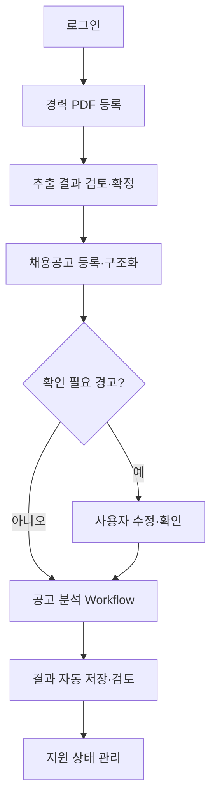
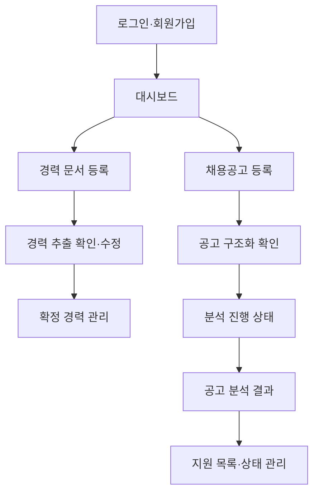

# AI 취업 지원 실행 플랫폼 핵심 사용자 여정 및 유스케이스

- 문서 버전: v0.2
- 작성일: 2026-07-22
- 단계: 2/6 - 핵심 사용자 여정 및 유스케이스
- 기준 문서: AI 취업 지원 실행 플랫폼 프로젝트 기획서 v0.2
- 문서 상태: 확정 정책 반영본
- 대상 범위: IT·개발 직군 경력직 및 중고신입을 위한 개인 개발자 MVP

## v0.2 변경 요약

| 구분 | v0.2 반영 내용 |
|---|---|
| 분석 재실행 | 세밀한 단계별 재실행을 제외하고 `경력 문서 분석 전체`, `회사 공식 정보 조사`, `공고 분석 전체`의 세 단위로 단순화했다. |
| 회사 조사 | 공고 분석에 기본 포함하며 매번 사용자에게 묻지 않는다. 식별·검색 실패에도 경력 매칭과 요구사항 판정을 계속한다. |
| 결과 저장 | 완료 또는 부분 완료 시 입력·상태·결과·근거·출처를 자동 저장한다. 별도 저장 버튼과 수동 저장 유스케이스를 제거했다. |
| 공고 확인 | 오류 경고가 없는 단일 직무 공고는 명시적 확정 없이 분석할 수 있다. 모호성 경고가 있으면 사용자 확인을 필수화했다. |
| AI 판정 수정 | 사용자가 네 가지 판정값을 직접 덮어쓰는 기능을 제외했다. 이의 피드백 또는 경력 수정 후 재실행만 제공한다. |
| 원문 근거 | 문서명·페이지 번호·원문 발췌까지만 Must로 두고 PDF 좌표 하이라이트를 Should로 이동했다. |
| PDF 실패 대응 | PDF를 기본 입력으로 유지하되 추출 실패 시 텍스트 직접 붙여넣기 후 문서 분석 전체 재실행을 제공한다. |
| 상태 표시 | 실시간 백분율을 제외하고 단계 상태만 표시한다. 관련 여정·유스케이스·예외·화면·우선순위를 함께 정리했다. |

프로젝트 목표, MVP 범위와 제외 범위, 목표 사용자는 기획서 v0.2에서 변경하지 않았다.

## 0. 문서 목적과 적용 원칙

이 문서는 사용자가 경력 문서를 등록한 시점부터 공고별 지원 판단과 상태 관리까지 완료하는 과정을 개발 가능한 사용자 행동 단위로 구체화한다. API, 테이블, 클래스, 모델, 프롬프트 구조는 확정하지 않는다.

- AI가 추출한 경력 정보는 `추출 후보`이며 사용자 확인 전에는 공고 분석 근거로 사용하지 않는다.
- 사용자 문서 또는 사용자가 직접 추가·확정한 정보에서 찾지 못한 경험은 생성하지 않는다.
- 공고 분석은 단계와 입출력이 정해진 Workflow로 실행한다.
- 회사 공식 정보 조사는 공고 분석에 기본 포함하며 공식 출처 최대 5건만 채택한다.
- 회사 정보에는 URL과 발행일 또는 확인일을 포함하고 일반·최신·공고 시점 정보를 구분한다.
- 적합성은 `충족 / 부분 충족 / 확인 불가 / 미충족`과 근거로 표현하며 합격 가능성 백분율은 제공하지 않는다.
- 자기소개서 문항 분석은 Should이며 핵심 여정과 Must 유스케이스에 포함하지 않는다.
- 지원 상태, 입력 검증, 중복 감지, Workflow 상태와 자동 저장은 일반 애플리케이션 로직이 담당한다.
- 사용자에게 실시간 진행률 백분율을 제공하지 않고 단계 상태만 표시한다.

### 0.1 상태 용어

| 대상 | 상태 | 의미 |
|---|---|---|
| 경력 문서 | 대기 / 분석 중 / 검토 필요 / 분석 실패 / 확정 완료 | PDF 등록부터 경력 정보 확정까지의 상태 |
| 채용공고 | 등록됨 / 구조화 중 / 확인 필요 / 분석 가능 / 구조화 실패 | 원문 등록부터 분석 가능한 요구사항 구조 확보까지의 상태 |
| 회사 조사 | 대기 / 진행 중 / 완료 / 근거 부족 / 실패 | 공식 출처 수집 결과와 기술 실패를 구분한 상태 |
| 공고 분석 | 대기 / 진행 중 / 부분 완료 / 완료 / 실패 | 통제된 Workflow 실행 상태 |
| 지원 | 관심 / 지원 검토 / 지원 예정 / 지원 완료 / 보류 / 지원하지 않음 | 사용자가 선택하는 공고별 상태 |

`부분 완료`는 일부 요구사항 판정 등 최종 분석 산출물의 일부가 생성되지 않았지만 사용자가 확인할 수 있는 결과가 존재하는 상태다. 회사 식별 실패·공식 자료 없음·회사 검색 실패만 발생하고 요구사항 판정과 준비 전략이 생성되었다면 `완료`로 처리하되 `회사 지원 근거 제한`을 표시한다. 완료와 부분 완료 결과는 모두 자동 저장한다.

## 1. 핵심 사용자 여정

### 1.1 전체 흐름

### 1.2 단계별 상세 여정

| 단계 | 사용자 행동 | 시스템 처리 | AI 처리 | 사용자에게 보여줄 결과 | 확인·승인 | 주요 실패 상황 | 다음 단계 진입 조건 |
|---|---|---|---|---|---|---|---|
| 1. 회원가입·로그인 | 계정을 만들거나 로그인한다. | 인증 정보를 검증하고 세션을 생성한다. | 없음 | 대시보드 또는 오류와 재시도 경로 | 가입 시 필수 동의 | 중복 계정, 인증 실패 | 유효한 세션 생성 |
| 2. 경력 문서 등록 | 이력서 또는 경력기술서 PDF를 등록한다. | 형식·크기·손상·중복 후보를 검사하고 분석 작업을 만든다. | 없음 | 파일 정보와 `대기` 상태 | 중복 후보가 있을 때만 확인 | 비지원 형식, 손상·암호화 PDF, 저장 실패 | 유효한 PDF 저장 및 작업 생성 |
| 3. 문서 분석 상태 확인 | 단계 상태를 확인한다. | `대기/분석 중/검토 필요/실패`를 갱신한다. | PDF 텍스트 추출 후 경력 구조화를 수행한다. | 현재 단계, 완료 시각, 실패 원인, 전체 재실행 경로 | 재실행 시 확인 | 텍스트 추출 실패, LLM 실패, 시간 초과 | 후보 생성 시 검토 화면, 실패 시 대체 입력 또는 재실행 |
| 4. 경력 추출 결과 확인 | 경력·프로젝트·기술·역할·성과와 근거를 확인한다. | 중복·충돌 후보를 표시하고 출처를 연결한다. | 원문 기반 후보를 만들고 불확실성을 표시한다. | 출처 문서명, 페이지, 원문 발췌, 후보값, 경고 | 모든 확정 대상 검토 필요 | 누락, 잘못된 기간·수치·역할, 중복·오병합 | 수정·병합·분리 가능한 후보 존재 |
| 5. 추출 정보 수정·확정 | 값을 수정·삭제하고 중복을 처리한 뒤 확정한다. | 필수값과 논리 충돌을 검증하고 확정본을 보존한다. | 사용자 수정값을 임의 보완하지 않는다. | 확정될 경력과 남은 경고 | 명시적 확정 필요 | 필수값 누락, 기간 충돌, 저장 실패 | 유효한 확정 경험 1개 이상, 필수 충돌 없음 |
| 6. 채용공고 본문 등록 | 회사명·제목·본문을 붙여넣는다. | 최소 입력과 중복 후보를 검사해 저장한다. | 회사·직무 구간 후보를 식별한다. | 원문, 중복·불완전·복수 직무 경고 | 중복 또는 모호성 경고 시 확인 | 불완전 본문, 회사명 불명확, 여러 직무 혼합 | 구조화할 수 있는 본문 확보 |
| 7. 공고 구조화 결과 확인 | 필요하면 회사명·직무·요구사항을 수정한다. | 경고 규칙으로 명시적 확인 필요 여부를 판정한다. | 업무·필수·우대·연차·기술·근무조건 후보와 근거를 만든다. | 구조화 결과와 원문 발췌, 오류·불확실성 경고 | 경고 없는 단일 직무는 불필요. 복수 직무·회사명 불명확·타 직무 혼입·필수/우대 불확실 시 필수 | 오분류, 다른 직무 혼입, 요구사항 부족 | 경고 없음 또는 필수 확인 완료. 사용자는 실행 전 언제든 수정 가능 |
| 8. 공고 분석 실행 | 분석을 실행한다. 회사 조사 포함 여부는 선택하지 않는다. | 확정 경력 스냅샷을 만들고 회사 조사와 매칭 Workflow를 수행한다. | 공식 회사 정보 조사, 경력 검색, 요구사항 판정, 전략 생성을 수행한다. | 단계별 상태만 표시 | 회사 식별 후보 선택이 필요한 경우만 확인 | 회사 식별·검색·LLM·경력 검색 실패 | 각 요구사항에 결과 또는 실패 상태 생성 |
| 9. 지원 판단·준비 전략 확인 | 결과와 근거·한계를 검토한다. | 완료/부분 완료 결과를 자동 저장하고 조회 가능하게 한다. | 근거 범위 안에서 강점·부족·확인 사항·준비 행동을 제안한다. | 요구사항별 판정, 경력 근거, 공식 출처, 분석 한계 | 저장 확인 불필요 | 회사 정보 없음, 일부 판정 실패, 근거 없음 | 자동 저장 성공. 실패하면 저장 재시도 상태 표시 |
| 10. 결과 이의·보완 | 판정에 동의하지 않음 피드백을 남기거나 누락 경력을 추가·수정한다. | 피드백을 AI 판정과 별도로 기록하되 판정값은 변경하지 않는다. | 재실행 전 기존 판정을 임의 수정하지 않는다. | 피드백 접수 또는 경력 수정 영향 안내 | 경력 변경 확정과 재실행 확인 | 저장 실패, 경력 미확정 | 피드백 저장 또는 경력 확정 후 공고 분석 전체 재실행 가능 |
| 11. 지원 상태 변경 | 여섯 상태 중 하나를 선택한다. | 상태와 변경 시각을 저장한다. | 없음 | 지원 목록, 현재 상태, 마지막 분석 상태 | 상태 선택만 필요 | 허용되지 않은 값, 저장 충돌 | 상태 저장 완료 |

### 1.3 통제된 공고 분석 Workflow

| 순서 | 단계 | 입력 | 완료 출력 | 실패 시 처리 |
|---|---|---|---|---|
| 1 | 입력 검증 | 분석 가능한 공고 구조, 확정 경력 스냅샷 | 실행 가능 여부 | 경력 미확정 또는 필수 확인 미완료면 중단 |
| 2 | 회사 식별 | 회사명, 공고 원문 | 회사 식별값 또는 모호성 상태 | 식별 실패를 기록하고 회사 조사 없이 다음 단계 계속 |
| 3 | 공식 정보 조사 | 식별된 회사, 직무, 공고 시점 | 공식 출처 0~5건 또는 근거 부족/실패 | 경력 매칭은 계속하고 회사 지원 근거 제한 표시 |
| 4 | 경력 후보 검색 | 요구사항, 확정 경력 | 요구사항별 관련 경험 후보와 원문 근거 | 근거 없음은 빈 결과로 정상 완료 |
| 5 | 요구사항별 판정 | 요구사항, 후보 근거 | 네 상태 중 하나, 이유, 근거 | 일부 실패 시 해당 요구사항을 실패로 두고 전체는 부분 완료 |
| 6 | 판단·준비 전략 생성 | 판정 결과, 공식 회사 정보 | 지원 판단 근거, 강점, 부족·확인 항목, 준비 행동 | 회사 정보가 없으면 회사 지원 근거 한계를 표시 |
| 7 | 자동 저장 | 입력, 실행 상태, 결과, 근거, 출처 | 재조회 가능한 완료/부분 완료 결과 | 저장 실패를 명시하고 제한 재시도. 완료로 오표시하지 않음 |

### 1.4 재실행 단위

| 재실행 단위 | 적용 상황 | 처리 원칙 |
|---|---|---|
| 경력 문서 분석 전체 재실행 | PDF 추출·구조화 실패, 대체 텍스트 입력 | 해당 문서의 텍스트 추출/입력부터 경력 후보 생성까지 전체 실행 |
| 회사 공식 정보 조사 재실행 | 회사 식별 보완, 공식 검색 실패·최신화 | 회사 조사 결과만 새로 만들고 기존 분석 결과에는 최신 조사 시점을 구분 |
| 공고 분석 전체 재실행 | 요구사항 일부 실패, 경력·공고 수정, 판정 이의 후 보완 | 입력 검증부터 판정·전략·자동 저장까지 전체 실행 |

실패한 세부 단계부터의 재실행과 모든 이전 산출물의 정교한 재사용은 Should다.

## 2. 사용자 여정 단계 구분

| 구간 | 사용자 목표 | 포함 활동 | 완료 조건 |
|---|---|---|---|
| 온보딩 | 개인 계정과 시작 지점을 확보한다. | 회원가입, 로그인, 대시보드 진입 | 인증 세션 생성 |
| 경력 정보 구축 | PDF 내용을 검토된 확정 경력으로 만든다. | 등록, 상태 확인, 추출, 대체 텍스트, 중복 검토, 수정·확정 | 유효한 확정 경험 1개 이상 |
| 채용공고 등록 | 분석할 단일 회사·직무와 요구사항 구조를 확보한다. | 본문 등록, 구조화, 조건부 확인·수정 | 오류 경고 없음 또는 필수 확인 완료 |
| 공고 분석 실행 | 확정 경력과 기본 포함된 회사 조사를 이용해 분석한다. | 공식 정보 조사, 경력 검색, 판정, 전략 생성, 자동 저장 | 완료 또는 부분 완료 결과 자동 저장 |
| 분석 결과 검토 | 근거와 한계를 확인하고 이의 또는 보완 여부를 결정한다. | 판정·근거·출처 검토, 동의하지 않음 피드백, 경력 보완 | 결과를 확인하고 다음 행동 결정 |
| 지원 의사결정·상태 관리 | 지원 여부와 진행 상태를 기록한다. | 여섯 상태 중 선택, 목록 확인 | 유효한 지원 상태 저장 |

## 3. 핵심 유스케이스

### 3.1 회원 및 인증

#### UC-AUTH-001 회원가입 및 로그인 — Must

- **목적:** 개인 사용자의 인증 상태를 만든다.
- **주요 사용자:** 미가입·가입 사용자
- **사전 조건:** 서비스 접속 가능
- **시작 조건:** 인증 정보를 제출한다.
- **기본 흐름:** 입력 검증 → 계정 생성 또는 인증 → 세션 생성 → 대시보드 표시
- **대안 흐름:** 이미 로그인되어 있으면 대시보드로 이동한다.
- **예외 흐름:** 중복 계정, 잘못된 인증 정보, 인증 오류를 표시한다.
- **사후 조건:** 유효한 세션이 존재한다.
- **사용자 확인:** 계정 생성과 필수 동의
- **관련 기획 요구:** 개인 사용자 MVP

### 3.2 경력 문서 및 경험 관리

#### UC-CAREER-001 경력 문서 등록 — Must

- **목적:** 이력서 또는 경력기술서 PDF를 추출 원본으로 등록한다.
- **주요 사용자:** 로그인 사용자
- **사전 조건:** 인증 완료
- **시작 조건:** PDF 등록 요청
- **기본 흐름:** 형식·크기·손상 검사 → 중복 후보 탐지 → 원본 저장 → 분석 작업 생성
- **대안 흐름:** 중복 후보면 기존 문서를 열거나 계속 등록한다.
- **예외 흐름:** 비지원 형식, 암호화·손상 PDF, 저장 실패를 안내한다. DOCX·이미지 OCR은 제공하지 않는다.
- **사후 조건:** PDF와 분석 작업이 연결된다.
- **사용자 확인:** 중복 후보가 있을 때만 필요
- **관련 기획 요구:** PDF 기본, DOCX·OCR 후순위

#### UC-CAREER-002 문서 분석 상태 확인 — Must

- **목적:** 비동기 문서 처리 단계와 실패를 확인한다.
- **주요 사용자:** 문서 등록 사용자
- **사전 조건:** 분석 작업 존재
- **시작 조건:** 대시보드 또는 문서 상세 조회
- **기본 흐름:** 단계 상태 표시 → 완료 시 추출 결과 화면 연결
- **대안 흐름:** 처리 중 화면을 떠나도 작업은 계속된다.
- **예외 흐름:** 추출·LLM·시간 초과 실패 원인과 경력 문서 분석 전체 재실행을 제공한다.
- **사후 조건:** 상태 조회 또는 새 전체 분석 실행
- **사용자 확인:** 재실행 선택
- **관련 기획 요구:** 백분율 제외, 단계 상태 표시

#### UC-CAREER-003 경력 정보 자동 추출 — Must

- **목적:** 원문에서 검토용 경력 후보와 근거를 생성한다.
- **주요 사용자:** 문서 등록 사용자
- **사전 조건:** PDF 텍스트 또는 대체 입력 텍스트 존재
- **시작 조건:** 분석 작업의 구조화 단계 진입
- **기본 흐름:** 경력·프로젝트·기술·역할·성과 추출 → 문서명·페이지·발췌 연결 → 중복·충돌 표시 → 검토 필요 저장
- **대안 흐름:** 정보가 부족하면 가능한 항목만 후보로 만든다.
- **예외 흐름:** 원문에 없는 값이나 근거 없는 후보는 경고·무효화한다.
- **사후 조건:** 후보가 저장되며 확정 경력에는 반영되지 않는다.
- **사용자 확인:** 모든 후보 검토 필요
- **관련 기획 요구:** 허위 경험 생성 금지, 정밀 좌표 하이라이트 후순위

#### UC-CAREER-004 PDF 추출 실패 대체 입력 — Must

- **목적:** PDF 텍스트 추출 실패로 사용자 여정이 중단되지 않게 한다.
- **주요 사용자:** 추출 실패 사용자
- **사전 조건:** 등록된 PDF의 추출 실패
- **시작 조건:** 사용자가 `텍스트 직접 입력`을 선택한다.
- **기본 흐름:** 원문 텍스트 붙여넣기 → 최소 길이·빈 입력 검증 → 대체 입력 저장 → 경력 문서 분석 전체 재실행
- **대안 흐름:** 다른 PDF를 다시 등록할 수 있다.
- **예외 흐름:** 빈 텍스트·과도하게 짧은 입력·저장 실패를 안내한다.
- **사후 조건:** 대체 텍스트가 해당 문서 분석의 입력으로 보존된다.
- **사용자 확인:** 입력 제출과 전체 재실행
- **관련 기획 요구:** PDF 기본, 추출 실패 시 텍스트 붙여넣기

#### UC-CAREER-005 추출 결과 수정 및 확정 — Must

- **목적:** AI 후보를 재사용 가능한 확정 경력으로 전환한다.
- **주요 사용자:** 추출 결과 검토 사용자
- **사전 조건:** 검토 필요 후보 존재
- **시작 조건:** 편집 시작
- **기본 흐름:** 근거 확인 → 수정·삭제·병합·분리 → 검증 → 명시적 확정
- **대안 흐름:** 일부만 확정할 수 있으나 공고 분석에는 확정 항목만 사용한다.
- **예외 흐름:** 필수값·기간·충돌·저장 오류를 표시한다.
- **사후 조건:** 확정 경력과 출처 연결 저장
- **사용자 확인:** 명시적 확정 필수
- **관련 기획 요구:** AI 추출 정보는 확인 전 미확정

#### UC-CAREER-006 확정 경력 정보 조회 및 수정 — Must

- **목적:** 누락 경험을 보완하고 분석 기준 경력을 최신 상태로 유지한다.
- **주요 사용자:** 확정 경력이 있는 사용자
- **사전 조건:** 인증 완료
- **시작 조건:** 확정 경력 관리 화면 진입
- **기본 흐름:** 경력 조회 → 수정·추가·삭제 → 검증·확정 → 이후 분석에 새 스냅샷 사용
- **대안 흐름:** 기존 분석은 당시 스냅샷 기준으로 유지한다.
- **예외 흐름:** 출처 없는 사용자 직접 입력은 해당 출처 유형으로 표시한다.
- **사후 조건:** 최신 확정 경력이 존재한다.
- **사용자 확인:** 변경 확정
- **관련 기획 요구:** 판정 직접 수정 대신 경력 보완 후 재실행

### 3.3 채용공고 관리

#### UC-JOB-001 채용공고 본문 등록 — Must

- **목적:** 분석할 공고 원문을 등록한다.
- **주요 사용자:** 확정 경력이 있는 사용자
- **사전 조건:** 인증 완료
- **시작 조건:** 회사명·제목·본문 제출
- **기본 흐름:** 최소 입력 검증 → 중복 후보 탐지 → 공고 저장 → 구조화 시작
- **대안 흐름:** 기존 동일 공고를 열 수 있다.
- **예외 흐름:** 불완전 본문·중복·개인정보성 입력을 경고한다.
- **사후 조건:** 원문과 구조화 작업 존재
- **사용자 확인:** 중복 후보 처리
- **관련 기획 요구:** 본문 등록 Must, URL 입력 Should

#### UC-JOB-002 채용공고 구조화 — Must

- **목적:** 단일 직무 기준 업무·필수·우대·연차·기술·근무조건을 만든다.
- **주요 사용자:** 공고 등록 사용자
- **사전 조건:** 공고 원문 존재
- **시작 조건:** 구조화 작업 시작
- **기본 흐름:** 회사·직무·요구사항 후보 추출 → 원문 근거 연결 → 오류·불확실성 경고 판정
- **대안 흐름:** 경고 없는 단일 직무는 `분석 가능` 상태로 전환한다.
- **예외 흐름:** 복수 직무, 회사명 불명확, 타 직무 혼입 가능성, 필수·우대 분류 불확실이면 `확인 필요`로 전환한다.
- **사후 조건:** 분석 가능 또는 확인 필요 상태
- **사용자 확인:** 경고가 있는 경우만 필수. 실행 전 언제든 수정 가능
- **관련 기획 요구:** 조건부 구조화 확인 정책

### 3.4 공고 분석

#### UC-ANALYSIS-001 공고 분석 실행 — Must

- **목적:** 확정 경력과 공고를 통제된 Workflow로 분석한다.
- **주요 사용자:** 공고 등록 사용자
- **사전 조건:** 확정 경력 존재, 공고 분석 가능 또는 확인 완료
- **시작 조건:** 분석 실행 요청
- **기본 흐름:** 입력 검증 → 회사 조사 → 경력 검색 → 요구사항 판정 → 전략 생성 → 자동 저장
- **대안 흐름:** 회사 조사 근거 부족·실패에도 매칭과 판정을 계속한다.
- **예외 흐름:** 경력 미확정이면 차단한다. 일부 요구사항 실패면 부분 완료로 저장한다.
- **사후 조건:** 완료 또는 부분 완료 결과 자동 저장
- **사용자 확인:** 회사 식별 후보가 모호한 경우만 필요
- **관련 기획 요구:** 회사 조사 기본 포함, Workflow, 자동 저장

#### UC-ANALYSIS-002 요구사항별 사용자 경험 매칭 — Must

- **목적:** 각 공고 요구사항을 확정 경력 근거와 연결한다.
- **주요 사용자:** 분석 실행 사용자
- **사전 조건:** 요구사항과 확정 경력 스냅샷 존재
- **시작 조건:** Workflow가 매칭 단계에 진입
- **기본 흐름:** 관련 경험 검색 → 근거 검증 → `충족/부분 충족/확인 불가/미충족` 판정과 이유 생성
- **대안 흐름:** 근거가 없으면 경험을 만들지 않고 기본적으로 확인 불가를 제안한다.
- **예외 흐름:** 일부 요구사항 처리 실패는 실패 상태로 남기고 분석을 계속한다.
- **사후 조건:** 각 요구사항에 판정 또는 실패 상태 존재
- **사용자 확인:** 판정값 직접 수정은 불가. 동의하지 않음 피드백 또는 경력 보완 가능
- **관련 기획 요구:** 근거 기반 네 상태, 허위 경험 금지

#### UC-ANALYSIS-003 지원 판단 결과 조회 — Must

- **목적:** 사용자가 지원 여부와 준비 행동을 결정하게 한다.
- **주요 사용자:** 완료·부분 완료 분석 사용자
- **사전 조건:** 자동 저장된 분석 결과 존재
- **시작 조건:** 결과 화면 진입
- **기본 흐름:** 요구사항별 결과 → 경력 근거 → 회사 출처 → 강점·부족·확인 사항 → 준비 전략과 한계 표시
- **대안 흐름:** 회사 정보가 없으면 매칭 결과는 제공하고 회사 지원 근거 제한을 표시한다.
- **예외 흐름:** 관련 근거가 없거나 일부 실패해도 결과를 완전한 것처럼 표현하지 않는다.
- **사후 조건:** 사용자가 지원 판단을 완료할 수 있다.
- **사용자 확인:** 지원 상태만 선택. 저장 확인 불필요
- **관련 기획 요구:** 합격 확률 제외, 자동 결과 보존

#### UC-ANALYSIS-004 AI 판정 이의 피드백 — Must

- **목적:** 판정값을 훼손하지 않고 사용자 불일치를 수집한다.
- **주요 사용자:** 결과 검토 사용자
- **사전 조건:** 요구사항 판정 존재
- **시작 조건:** `동의하지 않음` 선택
- **기본 흐름:** 대상 요구사항과 선택적 의견 저장 → AI 판정은 유지 → 경력 보완·재실행 경로 안내
- **대안 흐름:** 사용자가 피드백 없이 경력을 바로 수정할 수 있다.
- **예외 흐름:** 피드백 저장 실패를 안내한다.
- **사후 조건:** AI 판정과 별개의 피드백 존재
- **사용자 확인:** 피드백 제출
- **관련 기획 요구:** 사용자 판정과 AI 판정 별도 관리 기능은 후순위

#### UC-ANALYSIS-005 분석 실패 확인 및 재실행 — Must

- **목적:** 실패를 이해하고 단순한 단위로 복구한다.
- **주요 사용자:** 실패·부분 완료 분석 사용자
- **사전 조건:** 실패 원인 또는 재실행 가능한 입력 존재
- **시작 조건:** 실패 상세 또는 재실행 선택
- **기본 흐름:** 실패 단계·원인 표시 → 세 재실행 단위 중 가능한 항목 제시 → 사용자 선택 → 새 실행 이력 생성
- **대안 흐름:** 일부 요구사항 실패는 부분 완료로 자동 저장하고 공고 분석 전체 재실행을 제공한다.
- **예외 흐름:** 반복 외부 장애는 무한 재시도하지 않고 나중에 재시도를 안내한다.
- **사후 조건:** 새 전체 실행이 시작되거나 기존 자동 저장 결과 유지
- **사용자 확인:** 재실행 단위 선택
- **관련 기획 요구:** 세밀한 단계별 재실행·산출물 재사용은 Should

### 3.5 회사 정보 조사

#### UC-COMPANY-001 회사 공식 정보 수집 — Must

- **목적:** 공식 출처 최대 5건에서 회사·직무 연결 근거를 확보한다.
- **주요 사용자:** 공고 분석 사용자
- **사전 조건:** 공고 구조 존재
- **시작 조건:** 공고 분석 실행 시 자동 시작
- **기본 흐름:** 회사 식별 → 공식 소개·채용·최근 공식 자료 검색 → 관련성과 시점 기준 최대 5건 채택 → URL·발행일/확인일 저장
- **대안 흐름:** 최근 자료가 없으면 소개·채용 페이지만으로 완료한다.
- **예외 흐름:** 식별 실패, 공식 자료 없음, 검색 실패를 구분해 기록하고 매칭·판정은 계속한다.
- **사후 조건:** 공식 출처 0~5건 또는 근거 부족/실패 상태 저장
- **사용자 확인:** 동명 회사 후보 선택이 가능한 경우만 필요. 포함 여부는 묻지 않음
- **관련 기획 요구:** 공식 출처 중심, 최대 5건, 기본 포함

### 3.6 지원 결과 및 상태 관리

#### UC-APPLICATION-001 분석 결과 자동 보존 — Must

- **목적:** 공고 입력과 분석 맥락을 사용자 조작 없이 보존한다.
- **주요 사용자:** 공고 분석 사용자
- **사전 조건:** 분석이 완료 또는 부분 완료 상태에 도달
- **시작 조건:** Workflow의 저장 단계 자동 진입
- **기본 흐름:** 공고 입력·구조 → 경력 스냅샷 → 실행 상태 → 요구사항 결과 → 근거·출처·시점 자동 저장 → 결과 화면 표시
- **대안 흐름:** 부분 완료도 누락·실패 단계를 포함해 자동 저장한다.
- **예외 흐름:** 저장 실패 시 완료로 표시하지 않고 저장 재시도 상태와 원인을 표시한다.
- **사후 조건:** 재조회 가능한 결과가 존재한다.
- **사용자 확인:** 없음
- **관련 기획 요구:** 별도 저장 버튼 없는 자동 결과 보존

#### UC-APPLICATION-002 지원 상태 변경 — Must

- **목적:** 공고별 의사결정 상태를 관리한다.
- **주요 사용자:** 공고 등록 사용자
- **사전 조건:** 저장된 공고 존재
- **시작 조건:** 여섯 상태 중 하나 선택
- **기본 흐름:** 허용값 검증 → 상태와 변경 시각 저장 → 목록 반영
- **대안 흐름:** 분석 전에는 관심·지원 검토 상태를 사용할 수 있다.
- **예외 흐름:** 자동 제출은 하지 않으며 충돌·저장 실패를 안내한다.
- **사후 조건:** 하나의 현재 지원 상태 존재
- **사용자 확인:** 상태 선택
- **관련 기획 요구:** 여섯 지원 상태, 자동 지원 제외

## 4. 주요 예외·실패 시나리오

| ID | 상황 | 처리와 사용자 복구 | 결과 상태 |
|---|---|---|---|
| EX-01 | 지원하지 않는 문서 형식 | PDF만 허용하고 DOCX·이미지 OCR은 후순위임을 안내한다. | 등록 실패 |
| EX-02 | PDF 텍스트 추출 실패 | AI 구조화를 중단하고 텍스트 붙여넣기 또는 다른 PDF 등록 후 경력 문서 분석 전체 재실행을 제공한다. | 분석 실패 |
| EX-03 | 동일 경력이 여러 문서에 중복 | 자동 확정하지 않고 병합·분리 후보와 각 문서 근거를 표시한다. | 검토 필요 |
| EX-04 | AI 추출 정보가 잘못됨 | 사용자가 후보를 수정·삭제한 뒤 확정한다. 원문에 없는 값은 경고한다. | 검토 필요 |
| EX-05 | 경력 미확정 상태에서 분석 요청 | Workflow를 시작하지 않고 경력 확정 화면으로 안내한다. | 분석 차단 |
| EX-06 | 공고 본문 불완전 | 누락을 경고한다. 분석할 요구사항이 없으면 차단한다. | 확인 필요/차단 |
| EX-07 | 하나의 공고에 여러 직무 포함 | 직무 후보를 분리하고 분석 대상 직무 확인을 필수화한다. | 확인 필요 |
| EX-08 | 회사명 불명확·동명 회사 | 후보 선택이 가능하면 요청한다. 식별 실패로 끝나도 회사 조사만 제한하고 분석은 계속한다. | 조사 근거 부족 |
| EX-09 | 공식 회사 정보 없음 | 제3자 자료로 대체하지 않고 회사 지원 근거 제한을 표시한다. | 조사 근거 부족 |
| EX-10 | 관련 경력 근거 없음 | 경험을 생성하지 않고 기본적으로 확인 불가와 경력 보완 경로를 표시한다. | 정상 완료 |
| EX-11 | 외부 검색 또는 LLM 실패 | 제한된 기술 재시도 후 실패를 기록한다. 회사 검색 실패만 있으면 한계를 표시한 완료로 처리하고, 일부 요구사항·전략 생성 실패면 부분 완료한다. | 완료(한계 표시)/부분 완료/실패 |
| EX-12 | 분석 일부만 완료 | 완료 가능한 결과를 자동 저장하고 누락을 명시한다. 재실행은 공고 분석 전체 단위로 제공한다. | 부분 완료 |
| EX-13 | 동일 공고 중복 등록 | 기존 공고 열기 또는 새 분석 실행을 선택하게 하고 중복을 숨기지 않는다. | 사용자 확인 대기 |
| EX-14 | 자동 저장 실패 | 결과를 완료로 오표시하지 않고 저장 재시도 상태와 원인을 표시한다. | 저장 실패 |
| EX-15 | AI 판정에 사용자 불동의 | 판정값은 유지하고 피드백 또는 경력 수정 후 공고 분석 전체 재실행을 제공한다. | 결과 유지 |

## 5. 화면 흐름 초안

| 화면 | 화면 목적 | 핵심 정보 | 주요 사용자 행동 | 다음 이동 |
|---|---|---|---|---|
| 로그인·회원가입 | 인증 | 인증 입력, 오류 | 가입·로그인 | 대시보드 |
| 대시보드 | 준비·분석 상태 요약 | 확정 경력 여부, 단계 상태, 최근 공고, 실패 알림 | 문서·공고 등록, 결과 열기 | 각 상세 화면 |
| 경력 문서 등록 | PDF 추가와 분석 시작 | 지원 형식, 기존 문서, 중복 경고 | PDF 등록, 기존 문서 열기 | 대시보드·추출 결과 |
| 경력 추출 결과 확인·수정 | 후보를 근거와 비교해 확정 | 문서명, 페이지, 발췌, 후보값, 중복·충돌 | 수정·삭제·병합·분리·확정, 실패 시 텍스트 붙여넣기 | 확정 경력 관리 |
| 확정 경력 관리 | 분석 기준 경력 유지 | 확정 경험, 출처, 변경 영향 | 조회·추가·수정·삭제·확정 | 대시보드·공고 등록 |
| 채용공고 등록 | 공고 본문 등록 | 회사명, 제목, 본문, 중복·불완전 경고 | 등록·기존 공고 열기 | 공고 구조화 확인 |
| 공고 구조화 결과 확인 | 분석 가능 여부와 조건부 확인 | 직무·요구사항·원문 근거·경고 | 언제든 수정, 경고 시 확인, 분석 실행 | 분석 진행 상태 |
| 분석 진행 상태 | Workflow 단계와 실패 확인 | 회사 조사·매칭·판정·전략·저장 단계 상태 | 실패 상세, 세 단위 재실행, 부분 결과 보기 | 분석 결과·입력 화면 |
| 공고 분석 결과 | 자동 저장된 판단 근거 검토 | 네 상태, 경력 근거, 공식 출처, 한계, 준비 전략 | 근거 열기, 동의하지 않음, 경력 보완, 재실행, 지원 상태 선택 | 경력 관리·지원 목록 |
| 지원 목록·상태 관리 | 공고별 진행 추적 | 회사·직무·현재 지원 상태·마지막 분석 상태 | 필터, 결과 열기, 상태 변경 | 분석 결과·대시보드 |

별도 저장 버튼은 두지 않는다. 원문 근거는 문서명·페이지·발췌를 표시하며 좌표 기반 하이라이트 UI는 후순위다.

## 6. 개발 관점 검토

### 6.1 프로젝트 기획서 v0.2와 충돌하는 내용

- 프로젝트 목표, MVP 범위·제외 범위와 직접 충돌하는 내용은 없다.
- 기획서의 회사 공식 출처 최대 5건, 자기소개서 Should, IT·개발 경력직·중고신입 1차 검증 범위를 유지한다.
- 이번 v0.2 정책은 기획서의 폐쇄 루프를 바꾸지 않고 분석 실행·저장·복구 방식만 단순화한다.

### 6.2 MVP 범위로 과도한 사용자 흐름

- 실패 세부 단계부터 재실행하며 모든 이전 산출물을 재사용하는 기능
- PDF 좌표 기반 정밀 하이라이트와 복잡한 문서 레이아웃 대응
- 여러 문서의 동일 경험을 자동으로 확정 병합하는 기능
- 회사 식별과 공식 도메인 판별의 완전 자동화
- 사용자 판정과 AI 판정을 별도 값으로 관리·비교하는 기능
- 실시간 진행률 백분율과 세밀한 예상 완료 시간
- DOCX, 이미지 OCR, 복잡한 포트폴리오 분석

### 6.3 생략하거나 후순위로 이동할 유스케이스

- 세밀한 단계별 재실행과 산출물 재사용: Should
- PDF 좌표 하이라이트: Should
- 사용자 판정과 AI 판정의 별도 관리: Should
- 공고 URL 가져오기, 포트폴리오 등록, 자기소개서 문항 분석: 기획서와 동일하게 Should
- 비밀번호 재설정·소셜 로그인, 상태 변경 전체 이력, 복잡한 분석 버전 비교: 핵심 흐름 이후

### 6.4 아직 결정되지 않은 제품 정책

1. PDF 최대 용량·페이지 수와 암호화 PDF 처리 방식
2. 불완전 공고를 분석할 수 있는 최소 입력 기준
3. 동일 공고의 기존 기록 갱신과 새 분석 생성 기준
4. 사용자 직접 입력 경력의 최소 필수값과 출처 표시 방식
5. 종합 판단을 문장만 제공할지 제한된 등급도 제공할지
6. 보류·지원하지 않음 이유 입력의 필수 여부
7. 원본 문서·추출 데이터·자동 저장 결과의 보관·삭제 정책
8. 호출 제한과 재실행 횟수를 사용자에게 표시하는 방식

다음 항목은 v0.2에서 확정되었으므로 미결정이 아니다: 회사 조사 기본 포함, 회사 조사 실패 시 분석 계속, 조건부 공고 확인, 자동 결과 저장, AI 판정 직접 수정 제외, PDF 추출 실패 시 텍스트 대체 입력.

### 6.5 요구사항 명세 단계에서 확정할 내용

- 기능별 필수 입력, 검증 규칙, 완료 조건과 오류 메시지 수준
- 문서·공고·회사 조사·분석·지원 상태의 정확한 상태 전이
- 비동기 시간 초과, 제한 재시도, 중복 실행 방지 조건
- PDF 추출 실패 판단 기준과 대체 텍스트 최소 요건
- 공고 구조화의 네 가지 확인 필요 경고 판정 규칙
- 네 판정 상태의 출력 규칙과 동의하지 않음 피드백 최소 범위
- 회사 공식 출처 인정 범위와 최대 5건의 우선순위
- 완료·부분 완료 자동 저장의 필수 데이터와 저장 실패 복구
- 세 재실행 단위의 시작 조건과 기존 결과 표시 방식
- 개인정보, 접근 제어, 보관·삭제 비기능 요구

### 6.6 구현 전에 사용자가 결정해야 할 항목

| 우선순위 | 결정 항목 | 권장 MVP안 | 영향 |
|---|---|---|---|
| 1 | PDF 제한 | 10MB·50페이지 등 보수적 상한을 두고 암호화 PDF는 거절 | 처리 비용과 실패율 |
| 2 | 불완전 공고 최소 기준 | 회사 또는 식별 단서, 단일 직무, 요구사항 1개 이상 | 분석 가능 상태 규칙 |
| 3 | 중복 공고 처리 | 기존 공고를 유지하고 새 분석 실행으로 누적 | 지원 상태 분산 방지 |
| 4 | 사용자 직접 경력 입력 | 허용하되 `사용자 직접 입력` 출처와 명시적 확정 필수 | 문서 누락 보완과 근거 구분 |
| 5 | 종합 판단 표현 | 점수 없이 지원 고려 근거·주의 조건·추가 확인으로 제공 | 과도한 정밀 판단 방지 |
| 6 | 재실행 제한 | 실패 복구는 허용하되 반복 호출 상한과 나중에 재시도 안내 | 비용·오작동 통제 |
| 7 | 지원 상태 사유 | 선택 입력으로 시작 | 입력 마찰과 회고 데이터 균형 |

## 7. 단계 결론

MVP의 폐쇄 루프는 다음과 같다.

> 로그인 → 경력 PDF 등록 → AI 추출 후보 검토·확정 → 공고 등록·조건부 구조 확인 → 기본 포함된 회사 공식 정보 조사 → 확정 경력 기반 요구사항별 매칭 → 근거와 한계가 있는 지원 판단·준비 전략 자동 저장 → 지원 상태 선택

AI는 후보 추출·분류·근거 연결·설명을 담당하지만 사용자 경력을 대신 확정하거나 사용자의 이의만으로 판정값을 덮어쓰지 않는다. 회사 조사 실패나 일부 요구사항 실패는 숨기지 않고 근거 부족 또는 부분 완료로 남긴다. 복구는 세 가지 큰 단위로 제한해 개인 개발자가 구현 가능한 MVP 복잡도를 유지한다.
